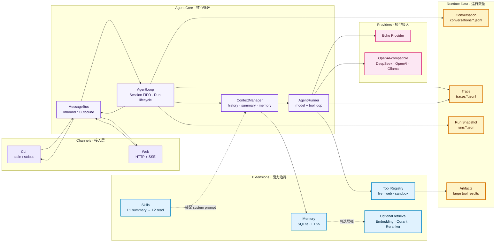

<p align="center">
  
</p>

# yomi

一个用 Go 实现的轻量 Agent 框架。yomi 先用少量角色组成一条稳定的核心循环，再把接入方式、工具、技能和模型能力放到循环边缘扩展。

> 项目名称统一为 **yomi**。当前代码入口 `cmd/szabot`、环境变量 `SZABOT_*` 以及部分存储路径仍保留早期技术标识，以兼容现有用法。

## 系统总架构

下面的图展示 yomi 从用户输入到模型响应，以及工具、记忆和运行数据如何接入核心循环：



核心原则是 **Core stays small; extend at the edges**：Channel 负责平台翻译，Provider 负责模型协议，工具和技能负责能力扩展，Agent Core 只负责编排消息、上下文与 Run 生命周期。

## 目录结构

```
szabot/
├── cmd/
│   ├── szabot/             # CLI 入口（main.go：只做装配）
│   └── skill-review/       # Skill 评审入口（独立工具）
├── internal/
│   ├── bus/                # 消息总线（系统中枢）
│   ├── agent/              # 核心循环
│   │   ├── loop.go         #   外层：消费 bus、协调上下文
│   │   └── runner.go       #   内层：跟 LLM 来回打交道
│   ├── channels/           # 通道（平台翻译官）
│   │   └── cli.go          #   stdin/stdout 实现
│   ├── skills/             # 技能加载与运行支持
│   ├── skillreview/        # Skill 评审内核
│   └── providers/          # LLM 提供商
│       ├── provider.go              #   统一接口
│       ├── echo.go                  #   假实现，零依赖验证链路
│       └── openai_compatible.go     #   OpenAI 兼容（DeepSeek/OpenAI/Moonshot/Ollama...）
└── go.mod
```

## 5 个核心角色

| 角色 | 朝向 | 职责 |
|---|---|---|
| **Channel** | 朝外 | 把平台原生消息 ⇄ 统一 `InboundMessage` / `OutboundMessage` |
| **MessageBus** | 中枢 | 用 Go channel 承载入站和出站消息 |
| **AgentLoop** | 中间 | 从 bus 接消息、加载 session、协调一次运行并推回 bus |
| **AgentRunner** | 朝内 | 跟 Provider 对话，驱动多轮 tool calling 循环 |
| **Provider** | 朝内 | 提供统一的 Echo 与 OpenAI-compatible LLM 接口 |

这五个角色构成边界：Channel 负责世界接入，Provider 负责模型接入，中间的循环只负责消息编排和一次运行，不承载具体业务。

## Agent 核心循环

核心循环按下面的顺序理解最容易：

```text
Channel -> MessageBus -> AgentLoop -> AgentRunner -> Provider
             ^                         |
             └──── OutboundMessage ───┘
```

### MessageBus：消息总线

MessageBus 是系统中枢，提供入站和出站两条队列。Channel 把平台消息翻译成统一的入站消息并写入 bus；AgentLoop 消费入站消息，再把结果写回出站队列。bus 不理解 CLI、Web 或具体模型，因此可以在不改核心循环的情况下替换接入端。

### AgentLoop：运行编排

AgentLoop 负责一次 Run 的外层生命周期：消费 bus 消息、按 SessionID 恢复会话、准备上下文、调用 Runner，并将最终回复或流式事件推回 bus。它协调运行，但不实现模型协议、工具细节或平台协议。

### AgentRunner：模型与工具循环

AgentRunner 是内层执行器，负责把 system prompt、Conversation 和本轮输入交给 Provider；收到 tool call 后执行工具、把结果追加回请求，直到得到最终 assistant 正文或发生错误/取消。多轮 tool calling、取消、重试和运行状态都属于这一层的执行语义。

## Agent 框架扩展

核心循环稳定后，新的能力优先通过四类扩展接入。

### Channel 接入

- **CLI**：stdin/stdout，SessionID 固定为 `cli:local`。
- **Web**：HTTP + SSE；`POST /api/send` 提交消息，`GET /api/stream?session=...` 接收流式事件。浏览器用 `localStorage` 保存 SessionID。

Web 没有认证和访问控制，只适合可信的本机环境。启用方式：

```bash
export SZABOT_WEB=1
export SZABOT_WEB_ADDR=127.0.0.1:8080
go run ./cmd/szabot
```

Go Web channel 只提供 `/api` 与 SSE，不再内嵌或托管前端文件。Vue 3 + TypeScript + Vite 前端独立位于仓库根目录 `web`，开发时需要分别启动后端和前端：

```bash
# 终端 1：Agent HTTP/SSE 后端
export SZABOT_WEB=1
export SZABOT_WEB_ADDR=127.0.0.1:8080
go run ./cmd/szabot

# 终端 2：Vue 前端
cd web
npm install
npm run typecheck
npm run dev
```

前端默认把 `/api` 代理到 `http://127.0.0.1:8080`，浏览器访问 Vite 输出的地址（默认 `http://localhost:5173`）。生产构建使用 `npm run build`，产物只保存在 `web/dist`。

### Tool 接入

#### 工具箱

| 工具 | 说明 | 依赖 |
|---|---|---|
| `read_file` / `write_file` / `edit_file` | 读取、覆盖写和精确替换工作区文本文件 | 无 |
| `list_dir` / `glob` / `grep` | 浏览目录、按名称查找、按正则搜索内容 | 无 |
| `web_fetch` | 读取 HTTP/HTTPS 页面并提取正文 | 无 |
| `todo_write` | 按 Session 维护任务清单和进度 | 无 |
| `ask_user_question` | 通过当前 Channel 向用户提问并等待回答 | 无 |
| `web_search` | 通过 Tavily 搜索互联网 | `TAVILY_API_KEY` |
| `bash` / `python` | 在临时 Docker 容器中执行命令或代码 | Docker + `SZABOT_SANDBOX=1` |

#### 工具注册条件

`read_file`、`write_file`、`edit_file`、`list_dir`、`glob`、`grep`、`web_fetch`、
`todo_write` 和 `ask_user_question` 默认注册。`web_search` 仅在设置
`TAVILY_API_KEY` 后注册；`bash` 和 `python` 仅在显式启用 Docker 沙盒且 Docker
可用时注册：

```bash
export TAVILY_API_KEY=tvly-xxxx
```

> `web_fetch` 当前只校验 URL 为 HTTP/HTTPS，没有阻止访问 localhost、私网地址、云元数据地址或重定向后的内网目标。因此不适合直接开放给不可信用户。

#### Docker 沙盒

```bash
export SZABOT_SANDBOX=1

# 可选
# export SZABOT_SANDBOX_NETWORK=1       # 允许容器联网，默认关闭
# export SZABOT_PYTHON_IMAGE=python:3.12-slim
# export SZABOT_BASH_IMAGE=debian:stable-slim
# export SZABOT_SANDBOX_TMP_SIZE=512m   # 默认 64m
```

未开启 `SZABOT_SANDBOX`、找不到 Docker CLI 或 Docker daemon 未运行时，yomi 会跳过 `bash` 和 `python`，其他工具仍可使用。每次执行都会创建临时容器，默认限制为 30 秒、512 MB 内存、1 个 CPU、256 个进程和 64 KiB 返回输出；根文件系统只读，`/tmp` 使用临时文件系统，网络默认关闭。

> Docker 沙盒不是只读工作区：宿主 workspace 会以**读写方式**挂载到容器的 `/work`。容器内命令可以创建、修改或删除工作区文件，这些变化会直接影响宿主机。沙盒主要隔离工作区之外的文件系统、网络和资源，不能替代权限控制、备份或代码审查。

文件工具拒绝绝对路径和 `..` 路径穿越；`read_file`、`edit_file` 还会拒绝解析后逃出 workspace 的符号链接。当前 `write_file` 只进行词法路径检查，若目标或父目录是指向 workspace 外部的符号链接，仍存在越界写风险。因此不要在工作区放置指向敏感位置的可写符号链接，也不要把工具能力开放给不可信用户。

Docker 安装、镜像选择、完整限制和安全边界见 [`docs/tools-and-sandbox.md`](docs/tools-and-sandbox.md)。

### Skill 加载

Skill 从 workspace 发现，并在 Agent 运行时按需加入模型上下文。默认关闭：

```bash
export SZABOT_SKILLS=off
export SZABOT_SKILLS=auto
export SZABOT_SKILLS=kbcli,github
```

详细定义和加载路径见 [`docs/skill-execution-path-review.md`](docs/skill-execution-path-review.md)。`cmd/skill-review` 是独立的离线评审入口，不参与主 Agent 链路；设计见 [`docs/skill-review-plan.md`](docs/skill-review-plan.md)。

### Provider 接入

Provider 统一 Echo（零依赖验证）和 OpenAI-compatible 实现，后者可复用 DeepSeek、OpenAI、Moonshot、Ollama 等服务。主程序当前通过环境变量装配 Echo 或 DeepSeek：

```bash
export SZABOT_PROVIDER=deepseek
export DEEPSEEK_API_KEY=sk-xxxxxxxx
export DEEPSEEK_MODEL=deepseek-v4-pro
go run ./cmd/szabot
```

未设置 Provider 时使用 Echo。OpenAI-compatible Provider 支持非流式响应和 SSE 增量中的 `reasoning_content`，并可将思考过程写入 Trace。当前 `buildProvider` 仍会把 API key 明文打印到控制台，仅建议本地调试使用。

### 快速开始

不设置任何环境变量即可运行零依赖的 Echo Provider：

```bash
go run ./cmd/szabot
```

输入一条消息后会收到 `echo:` 回复；按 Ctrl+C 退出。

如果使用 Web 界面，先执行 `SZABOT_WEB=1 go run ./cmd/szabot` 启动 API 后端，
再到 `web` 目录运行 `npm run dev` 并打开 Vite 地址。顶部的“配置”页会展示本次启动实际生效的配置、默认值、每项作用、
是否已配置以及是否需要重启。个人项目模式下配置页会显示完整 API key，建议只在本机访问。
首次运行只需保持默认的 Echo Provider，确认链路正常后再按页面说明配置真实模型或记忆增强能力。

Yomi 不会主动执行或解析 `~/.zshrc`；它读取启动命令所在 shell 继承的环境变量，因此需要在
`~/.zshrc` 中使用 `export KEY=value`，重新打开终端后再启动 Yomi。

也可以在 Agent 尚未启动前打开独立配置向导：

```bash
go run ./cmd/szabot --config
```

向导会在浏览器中提供可编辑表单，保存到 `.yomi/config.json`；之后直接运行
`go run ./cmd/szabot` 即可生效。也可以通过 `YOMI_CONFIG_FILE` 指定配置文件位置，
通过 `YOMI_CONFIG_ADDR` 修改向导监听地址。

## 能力扩展

### 上下文管理

Conversation 是供后续请求使用的主线历史，按 SessionID 持久化为 JSONL；只有 Run 成功完成后，才追加本轮 user 和最终 assistant。超过预算时，较早消息由当前 Provider 压缩为 rolling summary，再发送摘要、最近消息和当前输入；原始历史不删除。

```bash
export SZABOT_MAX_CONTEXT_TOKENS=100000
export SZABOT_CONTEXT_RECENT_MESSAGES=10
export SZABOT_TOOL_RESULT_MAX_TOKENS=10000
export SZABOT_CONTEXT_OUTPUT_RESERVE_TOKENS=10000
export SZABOT_SESSION_DIR=/sessionlogs
```

这些环境变量分别控制上下文预算和会话文件位置：

| 变量 | 示例值 | 说明 |
| --- | ---: | --- |
| `SZABOT_MAX_CONTEXT_TOKENS` | `8000` | 单次模型请求的上下文预算上限。预算包含消息、工具定义和输出预留；达到约 80% 时进入预警，超过上限时会压缩旧历史，仍无法满足则以 `context_budget_exceeded` 结束 Run。 |
| `SZABOT_CONTEXT_RECENT_MESSAGES` | `10` | 上下文超限进行 rolling summary 时，保留最近多少条历史消息原文；更早消息会被压缩为摘要。这里的单位是消息条数，不是 token。 |
| `SZABOT_TOOL_RESULT_MAX_TOKENS` | `1200` | 工具结果超过该近似 token 数时，会写入 `artifacts/`，模型只收到预览和 `artifact_id`，需要时再通过 `artifact_read` 读取原文。即使未超过该值，只要上下文接近上限，也可能被外置。 |
| `SZABOT_CONTEXT_OUTPUT_RESERVE_TOKENS` | `1024` | 为模型本轮输出预留的上下文空间，不是输出长度上限；预留越大，可用于输入消息的空间越小。 |
| `SZABOT_SESSION_DIR` | `sessionlogs` | 会话数据根目录，下面包含 `conversations/`、`archives/`、`artifacts/`、`traces/` 和 `memories/`。未设置时默认为启动工作目录下的 `sessionlogs/`。 |

代码使用长度近似估算 token（通常按约 4 字节折算 1 token），不是具体模型 tokenizer 的精确计数。当前代码默认值为：上下文上限 `6000`、近期消息 `8`、工具结果上限 `1200`、输出预留 `1024`。`export` 只对当前 shell 及其启动的子进程生效。

默认目录为启动工作目录下的 `sessionlogs/`：

```text
sessionlogs/
├── conversations/   # 会话主线
├── archives/        # 分阶段压缩检查点
├── artifacts/       # 超大工具结果的原文和元数据
├── traces/          # Run 完整轨迹
└── memories/
    └── memory.db     # 用户记忆当前状态、变更历史和 FTS5 索引
```

单次 Run 内，超过 `SZABOT_TOOL_RESULT_MAX_TOKENS` 或导致上下文接近上限的工具结果会
写入 `artifacts/`，模型只收到 preview 和 `artifact_id`。模型可以调用
`artifact_read` 按字节范围读取当前 Session 自己的原始结果。完整工具结果仍写入 Trace，
Artifact 不会替代 Conversation 的主线历史。

当历史被 rolling summary 压缩时，yomi 会在 `archives/` 追加独立的 ArchiveRecord，保存
覆盖范围、Run 和摘要内容，便于回溯任务演进；归档不会被默认全部回放给模型。

重置 Conversation 前先停止 yomi，再删除对应文件。当前锁只覆盖单个进程，不要让多个进程共享同一个 session 目录。

### 用户记忆（第一、二阶段）

Yomi 当前已接入一个按 `UserID` 隔离的长期记忆存储。记忆不替代 Conversation：Conversation
仍然保存为 JSONL 原文，用户记忆保存为结构化 SQLite 记录，当前支持 `fact`、`preference`
和 `episode` 三类内容。

记忆数据位于 `sessionlogs/memories/memory.db`，包含：

- 当前可服务的记忆记录；
- 只追加的记忆变更事件（新增、更新、冲突、删除）；
- 等待人工确认的持久化变更提案；
- SQLite FTS5 关键词索引。

Memory 数据目录跟随 `SZABOT_SESSION_DIR`。自动提取默认对真实 LLM Provider 开启，Echo
Provider 默认关闭：

```bash
export SZABOT_SESSION_DIR=./sessionlogs
# 可选：关闭 Run 完成后的异步记忆提取
export SZABOT_MEMORY_EXTRACTION=off
# 可选：限制一次记忆提取/索引任务的最长时间
export SZABOT_MEMORY_TIMEOUT=30s
# 可选：限制不明确替换等待用户确认的时间，超时后丢弃新候选
export SZABOT_MEMORY_CONFIRMATION_TIMEOUT=10m
go run ./cmd/szabot
```

异步记忆 curator 会先读取 L0 目录，再通过 `memory_browse` 按
`kind -> subject -> attribute -> records` 渐进检索；层级不明确时可以使用 `memory_search`。
`kind` 只有 `fact`、`preference`、`episode`，`subject` 表示记忆主体，通常为 `self`，也可以是
朋友、家人或其他实体。subject/attribute 都是模型生成的导航标签，不作为语义相等的依据；
curator 识别到同一语义槽位后会复用已有路径，例如用已有 `home_city` 承接新的
`home_province` 表述。

curator 只输出 `add`、`replace`、`coexist`、`no_op` 或 `needs_confirmation` 提案，代码负责
校验目标 ID、用户边界、目标版本和写入权限。明确的纠正（例如“我的家其实在四川”）可以直接
替换；关系不明确时，Yomi 会在同一 Session 队列中创建轻量确认 Run。确认后旧记录变为
`superseded` 并写入新记录；拒绝或超时会保留旧记录并丢弃新候选。待确认 proposal 保存在
SQLite 中，进程重启后会在原 Session 恢复，过期或目标版本已经变化的提案不会执行。

未设置时默认使用启动工作目录下的 `sessionlogs/`。Qdrant 默认使用本机
`http://127.0.0.1:6333`，执行 `go run ./cmd/szabot` 时会自动检测、启动或创建容器；
如果不需要 Qdrant，显式关闭即可：

```bash
export SZABOT_QDRANT_ENABLED=off
```

Qdrant 和 Embedding 语义索引只有在配置完整时才会启用：

```bash
export SZABOT_QDRANT_URL=http://localhost:6333
export SZABOT_QDRANT_COLLECTION=yomi_memories
export SZABOT_EMBEDDING_BASE_URL=https://api.openai.com/v1
export SZABOT_EMBEDDING_API_KEY=your-embedding-key
export SZABOT_EMBEDDING_MODEL=text-embedding-3-small
```

这里的 Embedding 模型只负责把查询和记忆转换成向量，例如 `BAAI/bge-m3`；它不是
Cross-Encoder 重排模型。配置 Embedding 后，Yomi 会并行执行 SQLite FTS5/BM25 关键词召回
和 Qdrant 向量召回，用 RRF 合并结果，再回查 SQLite 的用户、状态和有效期。

Cross-Encoder/Reranker 是可选的第三阶段：它接收查询和混合召回候选，逐条做更精确的交互
打分。目前代码已经提供可插拔的 `Reranker` 接口和 HTTP 适配器；只有配置模型后才会
调用重排模型。可以接入硅基流动或其他
提供 `/rerank` 接口的兼容服务，例如 BGE Reranker 系列。Reranker 需要单独的模型，不能
直接复用 `BAAI/bge-m3` 的 embedding 结果：

```bash
# 设置模型名后默认启用；也可以显式设置 SZABOT_RERANKER_ENABLED=on/off
export SZABOT_RERANKER_MODEL=BAAI/bge-reranker-v2-m3
export SZABOT_RERANKER_ENABLED=on
# 不设置时复用 SZABOT_EMBEDDING_BASE_URL 和 SZABOT_EMBEDDING_API_KEY
export SZABOT_RERANKER_BASE_URL=https://your-reranker-endpoint/v1
export SZABOT_RERANKER_API_KEY=your-reranker-key
export SZABOT_RERANKER_TOP_N=20
```

当前适配器发送 `model/query/documents/top_n`，读取带候选下标的 `results`，因此服务端需要
兼容常见 rerank API 的请求和响应格式。Reranker 只在 Qdrant + FTS5 混合召回已经启用时
执行；模型未配置、服务不可用或返回错误时，Yomi 保留 RRF 排序并记录降级原因。

启动时会打印记忆运行状态，API key 只显示 `configured`/`missing`，不会输出凭证内容：

```text
memory.db=... sqlite_fts5=enabled extraction=enabled extraction_timeout=30s
memory.context=catalog memory.tools=browse,search,get
memory.embedding.base_url=... model=BAAI/bge-m3 api_key=configured
memory.retrieval=hybrid=enabled reason=fts_bm25_plus_qdrant_rrf
memory.reranker.base_url=... model=... api_key=configured enabled=enabled
memory.reranker=requested=enabled enabled=enabled top_n=20 endpoint=/rerank
memory.qdrant.url=... collection=yomi_memories auto_start=enabled ready=enabled index=enabled
memory.qdrant.index_reason=enabled
```

如果看到 `hybrid=disabled` 或 `reranker=requested=enabled enabled=disabled`，同时查看
`memory.qdrant.index_reason` 和启动警告；常见原因是 Qdrant 未就绪、Embedding 配置不完整，
或 Reranker 缺少独立的 model/base URL/API key。日志不会打印 API key 的实际值。

`SZABOT_QDRANT_URL` 可以省略，默认值是 `http://127.0.0.1:6333`。只有在使用远程
Qdrant 时才需要显式填写 URL。

当 `SZABOT_QDRANT_URL` 指向本机（`localhost`、`127.0.0.1` 或 `::1`）时，`go run
./cmd/szabot` 会自动检测并启动或复用名为 `yomi-qdrant` 的 Docker 容器，并使用
`yomi-qdrant-data` volume 持久化数据；不需要手动执行 `docker run`。Yomi 不会自动拉取
镜像，首次使用前请手动准备镜像：

```bash
docker pull qdrant/qdrant:latest
```

收到 `SIGINT`/`SIGTERM` 关闭 yomi 时，如果本次启动是 yomi 创建或启动了 `yomi-qdrant`，
yomi 会在退出前停止该容器；如果容器在 yomi 启动前就已经处于运行状态，则不会停止它，
避免影响外部 Docker 编排或其他使用者。

需要手动管理本地 Qdrant 时，可使用以下 Docker 命令。容器停止后，重新运行
`go run ./cmd/szabot` 会按上面的自动启动规则恢复；也可以直接执行 `docker start`：

```bash
# 查看容器和端口状态
docker ps -a --filter name=^yomi-qdrant$

# 启动、停止、重启和查看日志
docker start yomi-qdrant
docker stop yomi-qdrant
docker restart yomi-qdrant
docker logs -f yomi-qdrant

# 查看 Qdrant volume 的实际挂载位置
docker volume inspect yomi-qdrant-data

# 检查服务是否可访问，以及列出 Collections
curl http://127.0.0.1:6333/collections
```

不要直接删除 `yomi-qdrant-data`，其中保存着 Qdrant 的向量索引。确认不再需要这些数据
后，才执行下面的清理操作；删除后无法通过 yomi 恢复，只能从备份重建：

```bash
docker rm -f yomi-qdrant
docker volume rm yomi-qdrant-data
```

#### Qdrant Web UI

本地 Qdrant 服务运行后，可打开 [http://localhost:6333/dashboard](http://localhost:6333/dashboard)
使用官方 Web UI 查看和搜索 Collections、检查数据点、管理 Snapshots，并通过 Console
调试 REST API。该界面只在 Qdrant 服务可访问时可用；远程 Qdrant 请将地址替换为对应的
集群 URL，并追加 `/dashboard`。

远程 Qdrant 不由 Yomi 管理。生产环境或已有容器编排时可关闭自动管理：

```bash
export SZABOT_QDRANT_AUTO_START=off
```

每次构造上下文时，`ContextManager` 只注入不含具体值和证据的 `<user_memory_catalog>` L0
目录。主模型需要具体记忆时调用只读的 `memory_browse`、`memory_search` 或 `memory_get`；
工具的 `UserID` 由宿主上下文绑定，模型不能在参数中指定其他用户。目录或检索失败不会阻塞
主对话；`superseded` 和 `deleted` 记录不会进入默认目录或检索结果。

`UserID` 是长期记忆的隔离键，`SessionID` 只是会话路由键。CLI 使用固定的
`UserID=local`；Web 使用 `SZABOT_USER_ID` 配置的统一用户标识（默认也是 `local`），
因此同一用户的不同 Web Session 会共享记忆。Web 页面顶栏可以直接切换当前用户；也可以在
启动前设置默认用户，例如：

```bash
export SZABOT_USER_ID=my-user
```

Web 页面顶部会显示当前 `UserID`。会话首次发送消息时会记录用户归属；切换到新的
`UserID` 后，旧用户的会话列表、历史和 Trace 都不可见，从而与长期记忆一起隔离。

配置页还提供“清空调试数据”操作。确认后会删除当前 `sessionlogs` 下的会话、Trace、Run、
Archive、Artifact，以及 SQLite 记忆和 Qdrant 向量；这是不可逆操作。

当前已支持 Run 完成后的异步工具化 curator、层级浏览、持久化人工确认、敏感信息策略过滤、
重复候选去重、SQLite 原子写入、Embedding 生成、SQLite FTS5/BM25 + Qdrant 的混合召回和 HTTP Reranker 适配。用户侧
`memory list / correct / forget` 入口仍尚未完成。完整设计、
数据模型和后续路线见
[`docs/user-memory-v1-design.md`](docs/user-memory-v1-design.md) 与
[`docs/context-and-memory-plan.md`](docs/context-and-memory-plan.md)。当前实现链路（启动配置、
分层召回、Qdrant、RRF、Reranker 和 Trace）见
[`docs/memory-hybrid-reranker-flow.md`](docs/memory-hybrid-reranker-flow.md)。

每个 Run 的 JSON 快照还会记录 Memory 子状态：`pending`、`running`、`completed` 或
`failed`，以及候选数、拒绝数、写入数、索引数和错误信息。Memory 事件会继续追加到同一个
Run 的 Trace；异步处理完成后会更新该 Run 快照。

### Trace 建设

Trace 不会回放给模型，按 Run 保存 JSONL 事件：Run 生命周期、system prompt、实际模型请求、reasoning、assistant 消息、工具参数与结果、错误、耗时和 usage。当前还会记录 Memory 目录注入、提取、proposal 决策与持久化、人工确认、策略决策、候选接受/拒绝、SQLite 写入和可选索引结果，并在 Run Snapshot 中保存 Memory 子状态和计数。Trace 含未脱敏原文，当前没有自动轮转、保留期或脱敏机制。完整格式和写入时机见 [`docs/conversation-and-trace.md`](docs/conversation-and-trace.md)。


## Harness

Harness 用来验证 Agent 在运行时、故障、安全和资源边界下仍然可控。详细设计与里程碑见 [`README_2.md`](README_2.md)。

### 运行时 Harness

- [x] 状态栏、用户提问、显式取消、流式输出和 Trace 持久化
- [x] Run / Model / Tool 三层状态、Run Snapshot 和 Web 状态查询
- [x] Provider 与工具错误分类、有限次数重试和指数退避

### 安全与权限 Harness

- [x] 文件工具 workspace 边界、路径穿越和越界 symlink 防护
- [x] Bash/Python Docker 沙盒：资源限制、临时文件系统和默认禁网
- [x] 宿主侧 PermissionGate：只读工具自动放行，高风险工具请求批准
- [ ] 完整越权攻击集、审批审计事件和 workspace 子目录级策略

安全模式下的审批提供 `Allow once`、`Allow always` 和 `Deny`。选择
`Allow always` 后，该工具在当前进程内不再重复询问；重启 yomi 后会恢复为需要审批。

```bash
export SZABOT_PERMISSION_MODE=safe
export SZABOT_PERMISSION_MODE=workspace-write
export SZABOT_PERMISSION_MODE=full
```

这些模式只控制宿主侧审批，不会扩大 workspace 路径边界，也不会自动开启 Docker 网络。

### 测试与评测 Harness

- [x] Runner、Provider、工具和取消流程的确定性单元测试
- [ ] Deterministic Provider、Scenario Runner、事件契约和真实任务回归集

```bash
go test ./...
```


## 目录结构

```text
szabot/
├── cmd/szabot/         # 主程序入口，只做装配
├── cmd/skill-review/   # Skill 独立评审入口
├── internal/bus/       # 消息总线
├── internal/agent/     # loop.go / runner.go
├── internal/channels/  # CLI、Web 等通道
├── internal/skills/    # Skill 加载与运行支持
├── internal/providers/ # Provider 接口与实现
└── go.mod
```

## 设计宪法

1. **Core stays small**：新功能挂在 channel / tool / provider / skill 边上，不把业务塞进核心循环。
2. **Less structure, more intelligence**：第二个实现出现时再抽接口。
3. **Prefer duplication over premature abstraction**：不写 `BaseChannel` 这类父类。
4. **Explicit over magical**：可配置项都出现在 config struct 中。

## 项目地图

Overview 会读取 workspace 的 `skills/` 和 `docs/`，展示架构、消息流、工具和文档索引，不执行 Skill，也不依赖 Docker：

```bash
go run ./cmd/overview -addr 127.0.0.1:8091 -workspace .
```

访问 `http://127.0.0.1:8091`。Overview 没有认证，只应在可信本机环境使用。

## 路线图

已完成：M1 项目骨架、M2 MessageBus、M3 AgentLoop + AgentRunner、M4 CLI、M5 EchoProvider、M6 OpenAI-compatible Provider、M8 Session 存储、M9 Tool 接口、M10 多轮 tool calling、M10.5 Docker 工具沙盒、M10.6 通用工具、M11 HTTP + SSE Web、M12.1 SQLite + FTS5 用户记忆存储和上下文注入。

待办：M7 配置加载（`~/.szabot/config.json`）、M12.4 Reranker 模型兼容性验证和重排质量评测、
M12.5 用户侧记忆查看/纠正/删除入口、M12.6 冲突记忆的自动版本化策略。

## 已知问题

`cmd/szabot/main.go` 的 `buildProvider` 会用 `DEBUG:` 打印 `DEEPSEEK_API_KEY` 明文。上线前应移除这些日志。
