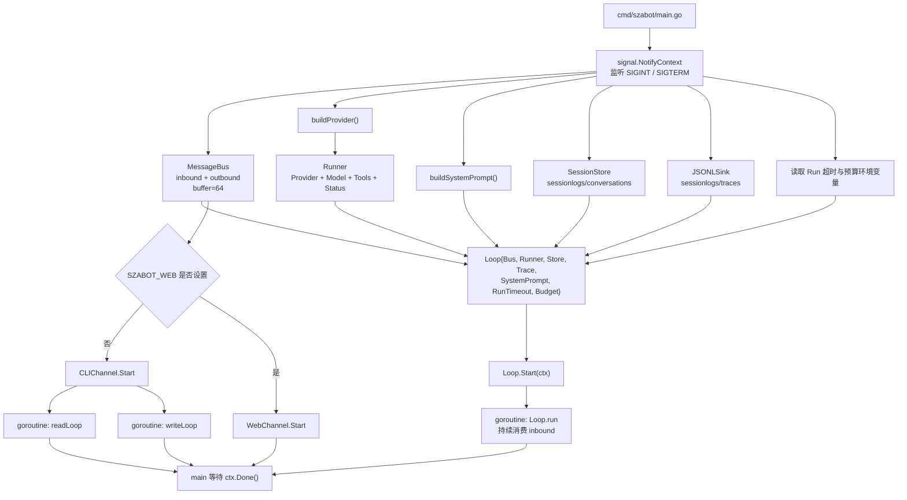
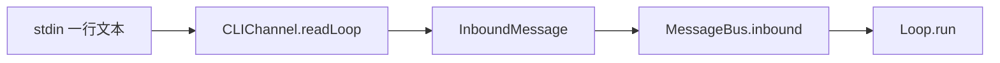
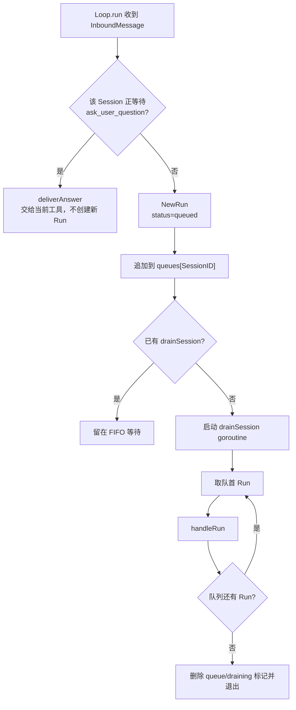
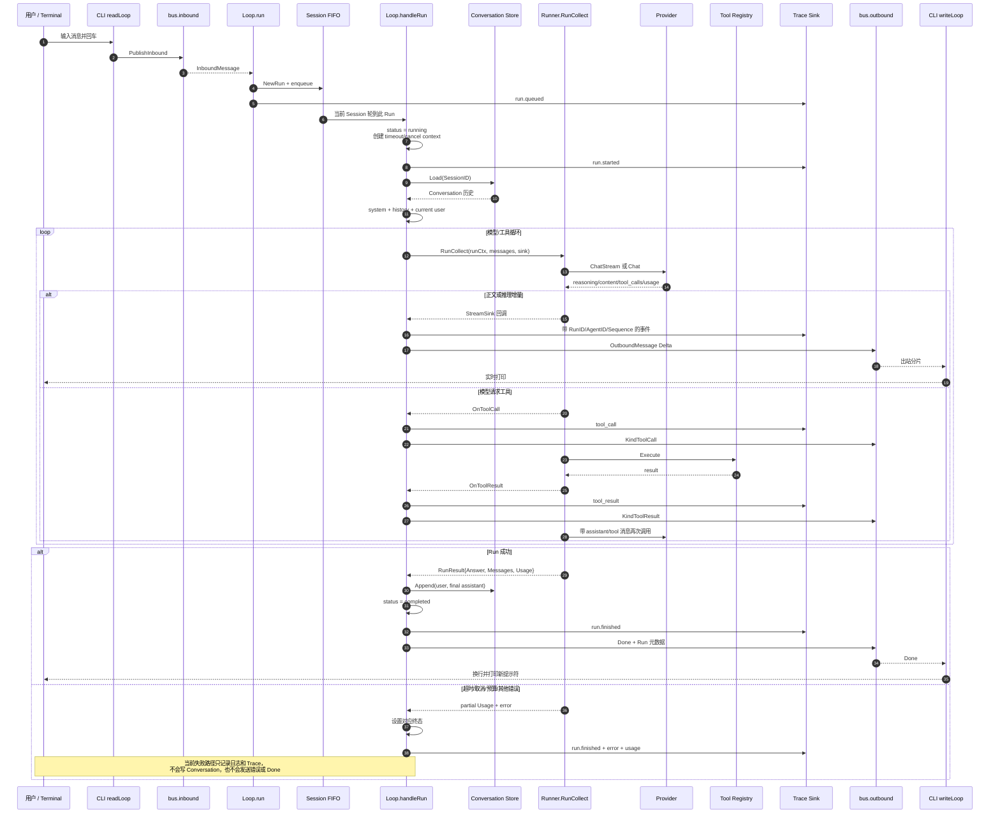
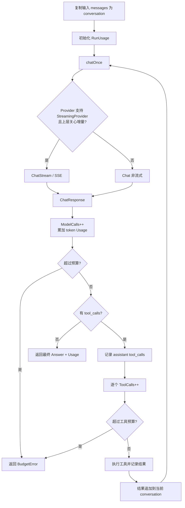
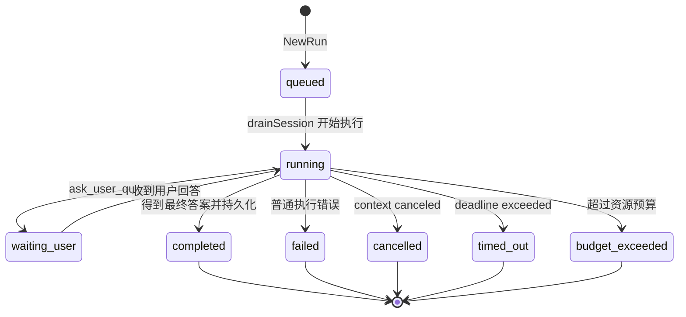
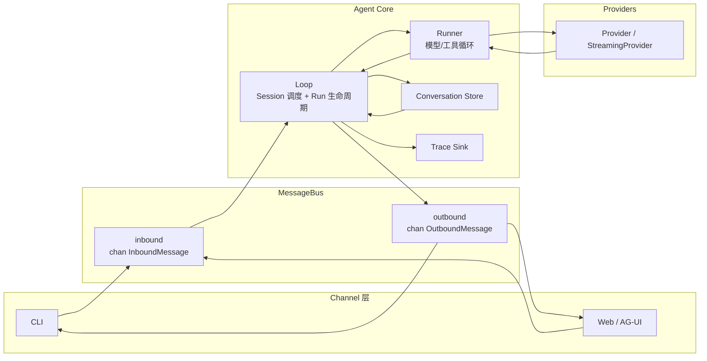

# 从命令行发送一条消息的完整处理链路

本文档描述当前 `szabot` 中，从 CLI 输入一条消息，到创建 Run、串行调度、调用模型与工具、持久化 Conversation/Trace，再到终端流式输出的完整流程。

## 核心文件

- [`cmd/szabot/main.go`](../cmd/szabot/main.go)：启动装配、Run 超时和预算配置
- [`internal/channels/cli.go`](../internal/channels/cli.go)：CLI 输入输出
- [`internal/bus/queue.go`](../internal/bus/queue.go)：入站/出站消息总线
- [`internal/bus/events.go`](../internal/bus/events.go)：统一消息协议
- [`internal/agent/loop.go`](../internal/agent/loop.go)：Session 调度、Run 生命周期、Conversation/Trace 协调
- [`internal/agent/run.go`](../internal/agent/run.go)：Run、状态、预算和 Usage
- [`internal/agent/runner.go`](../internal/agent/runner.go)：模型/工具循环及资源累计
- [`internal/agent/session.go`](../internal/agent/session.go)：Conversation JSONL
- [`internal/trace/trace.go`](../internal/trace/trace.go)：Trace Sink 与 JSONL 实现
- [`internal/providers/provider.go`](../internal/providers/provider.go)：Provider、Usage 和流式接口
- [`internal/providers/openai_compatible.go`](../internal/providers/openai_compatible.go)：非流式 OpenAI 兼容调用
- [`internal/providers/stream.go`](../internal/providers/stream.go)：SSE、工具调用拼接和流式 Usage

---

## 1. 当前核心模型

现在需要区分三个概念：

```text
Session
├─ Conversation：跨 Run 的用户可见主对话
└─ Run：一次用户请求对应的一次执行
   ├─ RunID
   ├─ AgentID
   ├─ Status
   ├─ Budget
   ├─ Usage
   └─ TraceEvent[]
```

### Session

`SessionID` 标识一段连续对话。CLI 固定使用：

```text
cli:local
```

同一个 Session 的多个请求必须严格串行，因为后一个请求需要读取前一个请求刚写入的 Conversation。

### Run

每条普通用户消息进入 `Loop.enqueue` 时都会立即创建独立 Run：

```text
RunID    = 随机 128-bit 十六进制字符串
AgentID  = "default"
Status   = queued
QueuedAt = now
```

`RunID` 是一次执行的身份；`SessionID` 是一段对话的身份。二者不能混用。

### Sequence

每个 Run 内部维护独立的 `Sequence`，每生成一条 Trace 或 Outbound 事件就递增。它用于恢复单个 Run 内的事件顺序，不要求跨 Run 全局递增。

---

## 2. 启动装配



`main` 只负责装配，不执行模型或工具逻辑。

默认运行配置：

| 环境变量 | 含义 | 默认值 |
|---|---|---:|
| `SZABOT_RUN_TIMEOUT` | Run 从开始执行起的总超时 | `3m` |
| `SZABOT_MAX_INPUT_TOKENS` | 最大输入 token | 不限 |
| `SZABOT_MAX_OUTPUT_TOKENS` | 最大输出 token | 不限 |
| `SZABOT_MAX_TOTAL_TOKENS` | 最大总 token | 不限 |
| `SZABOT_MAX_MODEL_CALLS` | 最大模型调用次数 | 不限 |
| `SZABOT_MAX_TOOL_CALLS` | 最大工具调用次数 | 不限 |

预算值为 `0` 表示不限制。非法负数或无法解析的值会被忽略。

> Run 超时在 Run 真正开始执行时生效，不包含 FIFO 队列中的等待时间。

---

## 3. CLI 输入与入站消息

`CLIChannel.Start` 启动两个 goroutine：

- `readLoop`：`stdin → InboundMessage → bus.inbound`
- `writeLoop`：`bus.outbound → stdout`

用户输入一行 `你好` 后，`readLoop` 构造：

```text
InboundMessage{
  ChannelID: "cli",
  SessionID: "cli:local",
  UserID:    "local",
  Text:      "你好",
  Time:      now,
}
```

空行只重新打印提示符，不进入 Agent。



---

## 4. 同 Session 串行调度

`Loop.run` 收到普通消息后不再直接启动任意 `handle` goroutine，而是调用 `enqueue`：

1. 创建独立 Run；
2. 把 `{InboundMessage, Run}` 追加到该 `SessionID` 的 FIFO；
3. 写入 `run.queued` Trace；
4. 如果该 Session 尚无 drainer，则启动一个 `drainSession` goroutine；
5. drainer 逐个调用 `handleRun`，前一个返回后才执行下一个。



并发语义：

```text
Session A: Run A1 -> Run A2 -> Run A3
Session B: Run B1 -> Run B2

A 与 B 可以并行；同一行内严格串行。
```

这样可以避免：

- 同 Session 的历史读取发生分叉；
- 多轮输出无序交错；
- `running[SessionID]` 的取消句柄互相覆盖；
- 后一轮看不到前一轮刚写入的最终回答。

---

## 5. 单个 Run 的完整执行链路



---

## 6. 上下文是如何构造的

Run 开始后，`Loop.handleRun` 从 Conversation Store 加载历史，然后构造：

```text
固定 system prompt
+ 已完成 Run 的 Conversation 历史
+ 本轮 user 消息
```

如果配置了 `Runner.Status`，每次真正调用 Provider 前，Runner 还会临时在末尾追加 Agent 状态栏：

```text
system
history...
current user
[Agent 状态栏 — 临时生成，不落盘]
```

状态栏不会写入 Conversation，也不会改变固定 system/history 前缀。

工具循环内部还会临时追加：

```text
assistant(tool_calls)
tool(result)
assistant(tool_calls)
tool(result)
...
assistant(final answer)
```

这些消息用于当前 Run 内继续调用模型，但不会整体进入下一轮 Conversation。

---

## 7. Runner 的模型/工具循环

`Runner.RunCollect` 最多执行 `MaxToolTurns` 轮，默认 `12`。



预算检查时机：

- 模型调用成功返回后：累计 token 与 `ModelCalls`，然后检查；
- 每个工具执行前：`ToolCalls++`，然后检查；
- 判断条件是 `used > limit`，即允许消耗恰好等于上限。

如果 Provider 没有报告 token usage：

```text
Usage.Reported = false
各 token 字段保持 0
```

此时 token 预算无法精确生效，但模型调用次数和工具调用次数预算仍然有效。

---

## 8. Provider 与 token usage

统一响应结构包含：

```text
ChatResponse{
  Content
  Reasoning
  ToolCalls
  FinishReason
  Usage{
    InputTokens
    OutputTokens
    TotalTokens
    CachedTokens
    ReasoningTokens
    Reported
  }
}
```

OpenAI 兼容字段映射：

| OpenAI 字段 | 内部字段 |
|---|---|
| `prompt_tokens` | `InputTokens` |
| `completion_tokens` | `OutputTokens` |
| `total_tokens` | `TotalTokens` |
| `prompt_tokens_details.cached_tokens` | `CachedTokens` |
| `completion_tokens_details.reasoning_tokens` | `ReasoningTokens` |

### 非流式

`OpenAICompatibleProvider.Chat` 从普通 JSON 响应的 `usage` 字段读取消耗。响应没有 `usage` 时，`Reported=false`。

### 流式

流式请求会发送：

```json
{
  "stream": true,
  "stream_options": {
    "include_usage": true
  }
}
```

Provider 通常在结束前返回一条 `choices: []` 的 usage 分片。`ChatStream` 即使该分片没有 choice，也会先提取 usage，再继续等待 `[DONE]`。

---

## 9. OutboundMessage 与事件身份

Loop 发出的每条业务分片都包含：

```text
OutboundMessage{
  SessionID
  ChannelID
  RunID
  AgentID
  Sequence
  Kind
  Text
  Delta
  Done
  Time
}
```

工具事件还包含：

```text
ToolCallID
ToolName
Arguments
```

各字段职责：

- `ChannelID`：回复应该由哪个 Channel 消费；
- `SessionID`：属于哪段用户会话；
- `RunID`：属于哪一次执行；
- `AgentID`：由哪个 Agent 产生，当前固定为 `default`；
- `Sequence`：该 Run 内事件顺序；
- `Kind`：`answer`、`reasoning`、`tool_call`、`tool_result` 或 `question`。

CLI 当前主要按 `ChannelID`、`Kind`、`Delta` 和 `Done` 渲染；Web/AG-UI 会直接使用核心 `RunID`，不再在展示层另造 RunID。

---

## 10. Conversation 与 Trace 分离

默认目录：

```text
sessionlogs/
├─ conversations/
│  └─ <session-id>.jsonl
└─ traces/
   └─ <run-id>.jsonl
```

可通过 `SZABOT_SESSION_DIR` 修改 `sessionlogs` 根目录。

### Conversation

一次成功 Run 只追加两条消息：

```json
{"role":"user","content":"帮我查一下"}
{"role":"assistant","content":"最终答案"}
```

以下内容不会进入 Conversation：

- system prompt；
- reasoning；
- tool calls；
- tool results；
- Agent 状态栏；
- 失败或取消 Run 的半截内容。

因此下一轮模型上下文只包含稳定、用户可见的主对话。

### Trace

每个 Run 对应一个 JSONL 文件。事件统一包含：

```text
sequence
timestamp
session_id
run_id
agent_id
type
status（可选）
data（可选）
```

当前会写入的主要事件包括：

```text
run.queued
run.started
model.request.started / model.response.finished
assistant.message.completed
tool_call / tool_result
question
run.finished
```

正文和 reasoning 的流式 delta 只通过 Bus 推送给 Channel，不写入持久化 Trace；完整正文和 reasoning 位于 `assistant.message.completed`。

`run.finished` 的 `data` 会包含最终 Usage；失败时还包含错误信息，成功时包含最终答案。

Trace 写入失败只记录日志，不中断用户请求。

> 旧版直接位于 `sessionlogs/*.jsonl` 的会话文件不会自动迁移到 `conversations/`。

---

## 11. Run 状态机



状态说明：

| 状态 | 含义 |
|---|---|
| `queued` | 已创建，正在 Session FIFO 中等待 |
| `running` | 正在加载历史、调用模型或执行工具 |
| `waiting_user` | `ask_user_question` 已发问，等待该 Session 下一条输入 |
| `completed` | 成功得到最终回答 |
| `failed` | 非超时、取消、预算类错误 |
| `cancelled` | Context 被主动取消 |
| `timed_out` | Run 超过截止时间 |
| `budget_exceeded` | token、模型调用或工具调用超过上限 |

Web 客户端通过 `POST /api/cancel` 显式请求时，可调用 `Loop.CancelSession` 取消该 Session 当前运行的 Run；SSE 断连本身不会取消任务。

---

## 12. Bus 的职责边界



职责划分：

- **Channel**：平台协议与统一消息之间的转换；
- **Bus**：搬运统一入站/出站消息；
- **Loop**：Session 串行调度、Run 生命周期、上下文和持久化协调；
- **Runner**：模型与工具循环、Usage 聚合和预算检查；
- **Provider**：具体模型协议、流式解析及 token usage；
- **Conversation Store**：跨 Run 的用户可见主对话；
- **Trace Sink**：单 Run 的内部执行事实。

---

## 13. 最终链路速查

```text
CLI stdin
  -> CLIChannel.readLoop
  -> InboundMessage
  -> MessageBus.inbound
  -> Loop.run
  -> NewRun(run_id, agent_id=default, status=queued)
  -> Session FIFO
  -> Loop.handleRun(status=running, timeout context)
  -> ConversationStore.Load(session_id)
  -> system + conversation + current user
  -> Runner.RunCollect
       -> Provider.ChatStream / Chat
       -> Usage 累加与预算检查
       -> 可选工具循环
  -> OutboundMessage(run_id, agent_id, sequence, kind)
  -> TraceSink.Record
  -> MessageBus.outbound
  -> CLIChannel.writeLoop
  -> stdout
  -> 成功后 ConversationStore.Append(user, final assistant)
  -> run.finished(status=completed, usage)
  -> Done
```

关键设计点：

- `SessionID` 决定对话历史和串行边界；
- `RunID` 标识一次独立执行；
- 同 Session 严格 FIFO，不同 Session 可以并行；
- `AgentID` 当前固定为 `default`，为未来 Multi-Agent 预留；
- `Sequence` 保证 Run 内事件可排序；
- Conversation 只保存用户与最终回答；
- Trace 保存推理、工具和 Run 生命周期；
- Provider Usage 汇总到 Run，并驱动预算控制；
- Run 超时、取消、预算超限均有独立终态。
