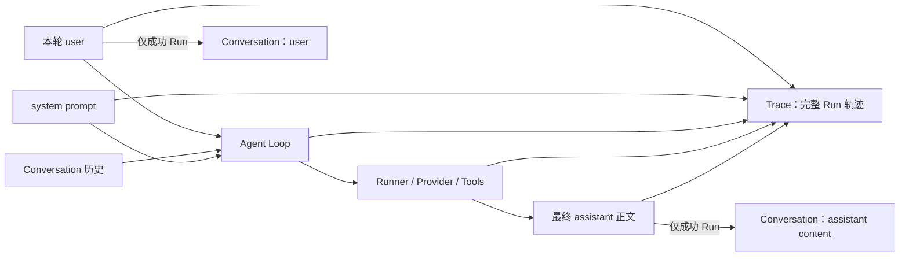

# Conversation 与 Trace

本文说明 yomi 当前的两类运行数据：用于后续模型上下文的 **Conversation**，以及用于观察和排障的 **Trace**。两者都是 JSONL，但用途、粒度、内容和清理方式不同。

## 1. 总览



| 项目 | Conversation | Trace |
|---|---|---|
| 主要用途 | 后续对话上下文 | 观察、审计、排障、运行轨迹展示 |
| 数据粒度 | 一个 Session 一个文件 | 一个 Run 一个文件 |
| 是否回放给模型 | 是 | 否 |
| system prompt | 不保存 | 保存完整内容 |
| reasoning | 不保存 | 保存增量和完整 assistant reasoning |
| 工具调用与结果 | 不保存 | 保存 |
| 失败 Run | 不写入本轮 user/assistant | 保存状态和错误 |
| 写入格式 | JSONL | JSONL 事件流 |

## 2. 存储目录

启动时，`cmd/szabot/main.go` 将当前工作目录视为 workspace。存储根目录按以下优先级确定：

1. 设置了 `SZABOT_SESSION_DIR`：使用该值；
2. 未设置：使用 `<启动工作目录>/sessionlogs`。

根目录下固定分为：

```text
<SZABOT_SESSION_DIR 或 workspace/sessionlogs>/
├── conversations/
├── archives/
├── artifacts/
└── traces/
```

示例：

```bash
export SZABOT_SESSION_DIR=/data/yomi-sessions
go run ./cmd/szabot
```

`SZABOT_SESSION_DIR` 可以是绝对路径或相对路径；相对路径由操作系统按启动时的当前工作目录解析。当前没有单独的 Trace 目录配置。

新建目录权限为 `0700`，新建 JSONL 文件权限为 `0600`。已有文件不会被强制改回 `0600`，部署时仍应检查实际权限。

## 3. Conversation

### 3.1 文件与 SessionID

Conversation 文件路径为：

```text
conversations/<清洗后的 SessionID>.jsonl
```

每行是一条 `providers.Message` JSON。

CLI 使用固定 SessionID：

```text
cli:local
```

因此默认文件为：

```text
sessionlogs/conversations/cli:local.jsonl
```

Web 前端通常生成 `web:<时间戳>:<随机串>` 并写入浏览器 `localStorage`；服务端在客户端未提供 SessionID 时也可以生成 `web:<UnixNano>`。SessionID 是路由标识，不是身份认证凭据。

文件路径会通过 `filepath.Clean` 和 `filepath.Base` 清洗，避免 `../` 逃出目录。但这不是无碰撞编码，例如不同原始 ID 可能被清洗成相同文件名，因此 SessionID 应由可信 Channel 按约定生成。

### 3.2 保存内容与写入时机

只有 Run 成功完成后，Loop 才会一次追加两条消息：

```jsonl
{"role":"user","content":"帮我概括 README"}
{"role":"assistant","content":"README 介绍了……"}
```

Conversation 只保存：

- 本轮原始 user 消息；
- 最终 assistant 正文 `content`。

不保存：

- system prompt；
- assistant reasoning；
- tool calls；
- tool results；
- Runner 临时注入的 Agent 状态栏；
- `ask_user_question` 的中间问题和回答；
- 失败、超时、取消或预算超限 Run 的本轮消息。

因此，某个失败 Run 的用户输入可能出现在 Trace 中，但不会进入后续 Conversation。

### 3.3 后续模型请求

收到同一 Session 的下一条用户消息时，Loop 首先加载 Conversation，然后按以下顺序组装上下文：

```text
system prompt
→ Conversation 历史
→ 本轮 user
→ Runner 临时注入的 Agent 状态栏（存在时）
```

在单次 Run 的工具循环内，Runner 还会对工具结果做预算控制。小结果直接进入下一次
模型请求；超过 `SZABOT_TOOL_RESULT_MAX_TOKENS` 或使上下文接近上限的结果会写入
`artifacts/`，模型收到带 preview 的 Artifact 引用。完整结果仍由 Trace 记录，模型可用
`artifact_read` 按范围读取当前 Session 的 Artifact。

跨 Run 的 `ContextManager` 与单次 Run 的 `Runner` 共享 `ContextBudget`。预算同时计算
消息、工具定义和模型输出预留；达到 80% 进入预警区，超过窗口则以
`context_budget_exceeded` 结束 Run，并映射为 `budget_exceeded` 状态。当前用户消息和
当前工具调用对应的消息对不会被静默删除。

当 rolling summary 成功覆盖一段旧历史时，Yomi 还会在 `archives/<session>.jsonl` 追加一条
独立的 ArchiveRecord，保存 Run、覆盖范围、消息数量、摘要和可识别的分段内容。原始
Conversation 不会被改写；summary 是当前请求的快速状态，archives 是任务演进的追加日志。

system prompt 在启动时构建，不写入 Conversation。这样可以保持稳定前缀，减少重复落盘，并有利于 Provider 的 KV Cache。

### 3.4 缓存与持久化

`SessionStore` 首次加载某个 Session 时读取磁盘，之后使用内存缓存。追加时同时更新文件和缓存。

Conversation 写入流程包含：

1. `O_APPEND` 追加；
2. `bufio.Writer.Flush()`；
3. `f.Sync()`。

单条 JSONL 消息的读取上限当前为 1 MB。超过上限或 JSON 损坏会导致该 Session 加载失败；Loop 会记录错误并将本轮降级为无历史运行。

## 4. Trace

### 4.1 文件与 RunID

Trace 是“一次 Run 一个文件”。文件名为 RunID 的 SHA-256：

```text
traces/<sha256(run_id)>.jsonl
```

RunID 和 SessionID 保存在每条事件内部，文件名本身不能直接反推出它们。一个 Session 通常对应多个 Run 和多个 Trace 文件。

### 4.2 事件结构

每行都是一个 `trace.Event`：

```json
{
  "schema_version": 1,
  "sequence": 3,
  "timestamp": "2026-08-22T01:00:00Z",
  "session_id": "cli:local",
  "run_id": "...",
  "agent_id": "...",
  "type": "assistant.message.completed",
  "status": "completed",
  "duration_ms": 123,
  "data": {}
}
```

核心字段：

| 字段 | 说明 |
|---|---|
| `schema_version` | 当前为 `1` |
| `sequence` | Run 内事件序号 |
| `timestamp` | 事件时间 |
| `session_id` | 所属 Session |
| `run_id` | 所属 Run |
| `agent_id` | Agent 标识 |
| `type` | 事件类型 |
| `status` | 可选状态 |
| `duration_ms` | 可选耗时 |
| `data` | 事件特有数据 |

### 4.3 主要事件

| 事件类型 | 主要内容 |
|---|---|
| `run.queued` | Run 已排队 |
| `run.started` | Run 开始 |
| `system.message` | 完整 system prompt |
| `input.received` | 用户输入、Channel、历史消息数量 |
| `context.injected` | 临时 Agent 状态栏 |
| `context.compacted` | 长会话超出预算后生成 rolling summary |
| `context.archived` | 一段已压缩历史被保存为独立 ArchiveRecord |
| `context.strategy.applied` | 一次上下文处理的策略汇总：触发原因、尝试层级、最终层级、动作和 token 变化 |
| `artifact.created` | 大型工具结果已写入 Artifact 的标识、大小和来源 |
| `context.strategy.applied` | 工具结果在 WorkingContext 中的保留、截断或 Artifact 替换决策；同时记录实际采用的策略 |
| `model.request.started` | Provider、模型、完整请求消息、工具定义数量和本轮完整工具定义 |
| `model.response.finished` | finish reason、usage、首 Token 时间、耗时 |
| `model.request.failed` | 模型请求错误 |
| `assistant.message.completed` | 完整 assistant 消息，含 `content`、`reasoning`、`toolCalls` |
| `tool_call` | 发往 Channel 的工具调用事件 |
| `tool_result` | 发往 Channel 的工具结果事件 |
| `tool.execution.started` | 工具名称和完整参数 |
| `tool.execution.finished` | 工具结果、结果大小和耗时 |
| `tool.execution.failed` | 工具错误 |
| `user.question.asked` | Agent 向用户提出的问题和选项 |
| `user.question.answered` | 用户回答和等待耗时 |
| `run.finished` | 最终状态、usage、答案或错误 |

DeepSeek 等推理模型的完整思考内容位于：

```text
assistant.message.completed
└── data.message.reasoning
```

流式 reasoning 只通过 Bus/Channel 实时发送；Trace 保存模型步骤结束时聚合后的完整 reasoning，不保存逐片增量。

### 4.4 查询行为

`ReadRun(runID)` 根据哈希文件名读取一个 Run，并验证文件内事件的 RunID 与请求一致。

`ReadSession(sessionID)` 会遍历所有 Trace 文件，筛选匹配的 SessionID，再按时间、RunID 和 sequence 排序。单个损坏或正在写入且无法解析的 Run 文件会被跳过，不阻断其他 Run 的查询。

### 4.5 Web Trace 工作台

启用 Web Channel 后，浏览器的 Trace 视图通过以下只读接口读取当前 Session 的轨迹：

```text
GET /api/traces?session=<session_id>
GET /api/traces/run?run_id=<run_id>
```

第一个接口返回当前 Session 的 Run 摘要，第二个接口返回一个 Run 的完整事件。浏览器
不会直接读取 `sessionlogs/traces/`，也不会接触 Trace 文件的 SHA-256 文件名。Trace
详情面板按事件展示状态、Sequence、时间、耗时和 `data` Payload。

## 5. 失败、超时与取消

Run 失败时：

- Trace 记录 `model.request.failed`、工具失败事件或 `run.finished` 的错误状态；
- Conversation 不追加本轮 user 和 assistant；
- 后续请求不会从 Conversation 中看到该失败输入。

Run 可能以 `failed`、`timed_out`、`cancelled`、`budget_exceeded` 等状态结束，具体取决于错误类型。

## 6. 清理和重置

### 重置单个 Conversation

必须先停止 yomi，再删除文件：

```bash
rm 'sessionlogs/conversations/cli:local.jsonl'
```

然后重新启动。运行中直接删除文件不会清除 `SessionStore` 的内存缓存，旧历史仍可能继续参与后续请求。

### 清理所有 Trace

先停止 yomi，再执行：

```bash
rm -f sessionlogs/traces/*.jsonl
```

Artifact 原文和元数据位于 `sessionlogs/artifacts/`。它们按 Session 子目录保存；清理
某个 Session 前应先停止 yomi，再删除对应 Artifact 目录。Artifact 是可恢复的工具结果
副本，不属于 Conversation，不能把它们混入 `conversations/`。

由于 Trace 文件名是 RunID 哈希，不能仅通过文件名识别某个 Session。若要按 Session 精细清理，需要先读取文件内的 `session_id`。

### 旧数据迁移

早期版本可能把 Conversation 放在：

```text
~/.szabot/sessions/
sessionlogs/
```

迁移前先停止 yomi，再将确认属于 Conversation 的 JSONL 文件复制到新的 `conversations/`。不要把 Trace 事件 JSONL 混入 Conversation 目录，两者 schema 不同。

## 7. 安全与并发边界

### 敏感数据

Trace 当前可能原样保存：

- system prompt 和 Skill 摘要；
- 用户输入和模型完整请求；
- reasoning；
- 工具参数、文件内容和工具结果；
- 用户对 Agent 问题的回答；
- 模型和工具错误。

当前没有字段脱敏、内容裁剪、自动轮转、存储配额、保留期或自动删除功能。不要将 `sessionlogs/` 提交到版本库，也不要上传到不可信位置。

### 并发

Conversation 和 Trace 都只使用进程内互斥锁。它们不提供跨进程文件锁、事务或缓存同步，因此不要让多个 yomi 进程共享同一个 `SZABOT_SESSION_DIR`。

### Trace 持久化强度

Conversation 每次追加后执行 `fsync`。Trace 当前只执行缓冲区 `Flush`，没有显式 `fsync`；进程或机器异常时，最后少量 Trace 事件可能尚未稳定落盘。

## 8. 相关实现

- `cmd/szabot/main.go`：目录装配和环境变量解析；
- `internal/agent/session.go`：Conversation JSONL 存储；
- `internal/agent/loop.go`：上下文组装、Conversation 写入和 Trace 事件产生；
- `internal/agent/runner.go`：模型步骤、reasoning 与工具调用；
- `internal/trace/trace.go`：Trace JSONL 写入和查询；
- `internal/providers/provider.go`：Conversation 消息数据结构。

其中 `model.request.started.data.tool_definitions` 是该轮请求实际发送给 Provider
的工具定义快照，包含工具名称、描述和参数 Schema；它不是 system prompt 的一部分，
但属于模型请求上下文的重要组成部分。
