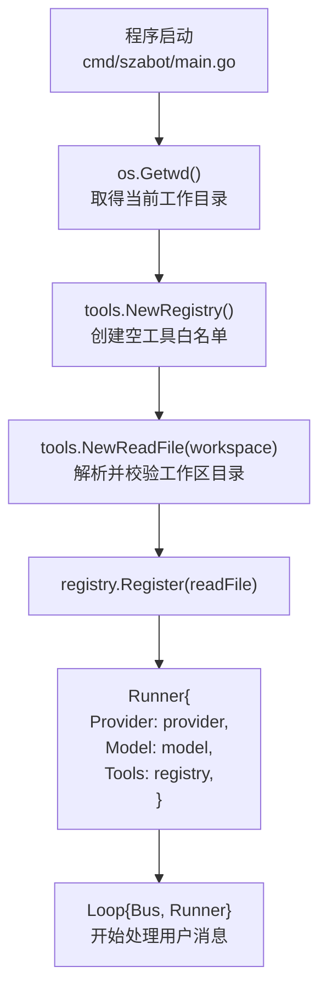
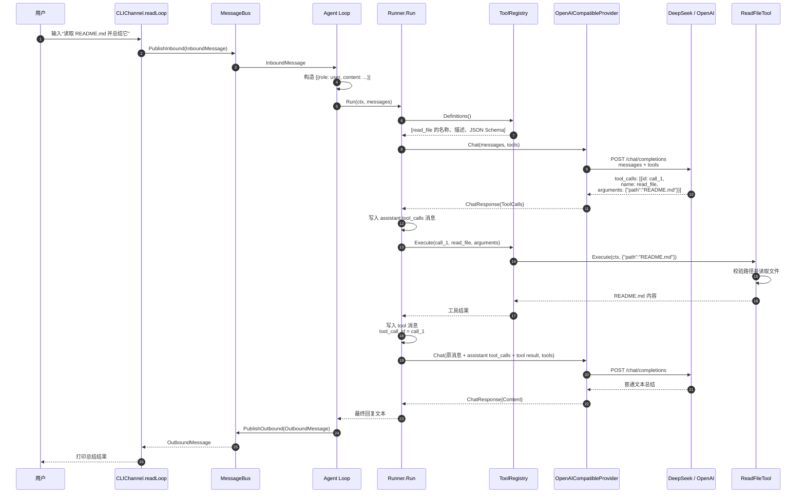
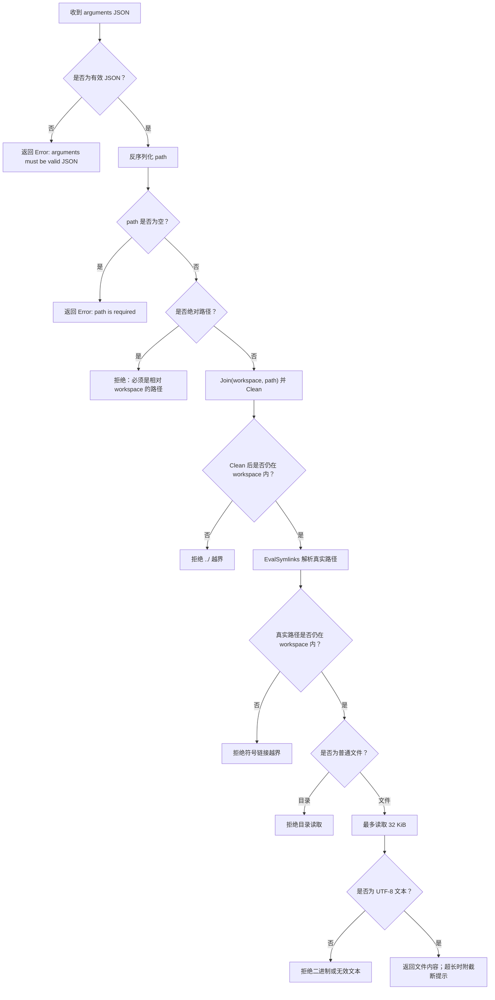
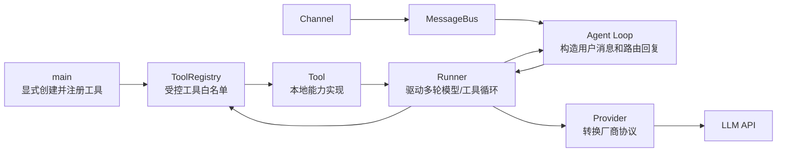

## Function Calling：从工具注册到用户收到最终回复

本文档描述当前 `yomi` Function Calling 的完整链路。代码入口和环境变量仍使用
`szabot` 兼容标识；本文以 `cmd/szabot` 和 `internal/` 的当前实现为准。

当前实现同时支持 OpenAI Chat Completions 兼容协议的非流式和 SSE 流式请求；
`OpenAICompatibleProvider` 可用于 DeepSeek、OpenAI、Moonshot、Ollama 等兼容
`/chat/completions` 的服务。主程序目前通过 `SZABOT_PROVIDER` 暴露 Echo 和
DeepSeek 两个装配入口。

涉及的核心文件：

- [`main.go`](../cmd/szabot/main.go)
- [`loop.go`](../internal/agent/loop.go)
- [`runner.go`](../internal/agent/runner.go)
- [`tool.go`](../internal/tools/tool.go)
- [`provider.go`](../internal/providers/provider.go)
- [`openai_compatible.go`](../internal/providers/openai_compatible.go)
- [`stream.go`](../internal/providers/stream.go)
- [`cli.go`](../internal/channels/cli.go)

### 1. 先理解：模型不直接执行本地函数

Function Calling 的本质不是让模型在本机执行 Go 函数，而是一次受控的协议协作：

```text
模型：请调用 read_file，参数是 {"path":"README.md"}
  -> Runner：仅从已注册的工具中查找 read_file
  -> ReadFileTool：校验参数与路径后读取文件
  -> Runner：把文件内容作为 tool 消息发回模型
  -> 模型：根据文件内容生成最终回答
```

因此模型只有“请求调用”的权限，没有任意执行本机函数、读取任意路径或绕开工具注册表的权限。

### 2. 启动时：工具如何被注册

当前工具注册在 `cmd/szabot/main.go` 的装配阶段完成。程序会将启动时的当前工作目录作为工作区，创建一个空的 `tools.Registry`，然后显式注册基础工具；联网搜索和 Docker 执行工具按环境变量条件注册。



这里的 `Registry` 是显式 allowlist：只有通过 `Register()` 注册的工具才会被模型看到、也才可能被执行。

`Register()` 会拒绝：

- `nil` 工具；
- 空工具名；
- 无效 JSON Schema；
- 重复工具名。

当前工具集合：

| 工具名 | 用途 | 作用范围 |
|---|---|---|
| `read_file` / `write_file` / `edit_file` | 读取、写入和精确修改工作区文本 | workspace 内 |
| `list_dir` / `glob` / `grep` | 浏览、查找和搜索工作区 | workspace 内 |
| `web_fetch` | 获取 HTTP/HTTPS 页面正文 | 网络请求 |
| `todo_write` | 维护当前 Session 的任务清单 | Session 内存状态 |
| `ask_user_question` | 在当前 Channel 向用户提问并等待回答 | Channel |
| `web_search` | Tavily 联网搜索 | `TAVILY_API_KEY` |
| `bash` / `python` | 执行命令或 Python 代码 | Docker + `SZABOT_SANDBOX=1` |

未来添加工具时，同样在装配层显式创建并注册即可，例如 `registry.Register(listFiles)`；不需要修改 `Loop`、`Runner` 的主流程。

### 3. 工具如何描述给模型

每个工具实现同一个 `tools.Tool` 接口：

```text
Name()        工具唯一名称
Description() 告诉模型何时使用
Parameters()  参数 JSON Schema
Execute()     本地实际执行逻辑
```

`read_file` 提供的核心 JSON Schema 等价于：

```json
{
  "type": "object",
  "properties": {
    "path": {
      "type": "string",
      "description": "相对于工作区根目录的 UTF-8 文本文件路径"
    }
  },
  "required": ["path"],
  "additionalProperties": false
}
```

`Registry.Definitions()` 会取出所有已注册工具，按工具名排序，生成稳定的 `Definition` 列表。`Runner` 再将其转换为 Provider 使用的 `providers.ToolDefinition`，附加到每次 `ChatRequest`：

```text
Tool Registry
  -> []tools.Definition
  -> []providers.ToolDefinition
  -> ChatRequest.Tools
  -> OpenAI-compatible HTTP 请求的 tools 字段
```

稳定排序避免同一组工具因 map 遍历顺序变化而导致请求内容抖动。

### 4. 用户请求工具时的完整时序

假设用户输入：

```text
读取 README.md 并总结它
```

完整链路如下：



### 5. 发给模型的两次请求分别长什么样

#### 第一次：让模型决定是否调用工具

`Runner` 发给 Provider 的内部请求包含用户消息与工具定义：

```text
ChatRequest{
  Model: "deepseek-chat",
  Messages: [
    {Role: user, Content: "读取 README.md 并总结它"}
  ],
  Tools: [read_file definition]
}
```

`OpenAICompatibleProvider` 将它编码为 OpenAI-compatible 请求：

```json
{
  "model": "deepseek-chat",
  "messages": [
    {"role": "user", "content": "读取 README.md 并总结它"}
  ],
  "tools": [
    {
      "type": "function",
      "function": {
        "name": "read_file",
        "description": "读取工作区内的 UTF-8 文本文件。路径必须相对于工作区根目录，不能读取工作区外的文件。",
        "parameters": {"type": "object", "properties": {"path": {"type": "string"}}, "required": ["path"]}
      }
    }
  ],
  "stream": false
}
```

模型若无需工具，会直接返回普通 `content`，Runner 随即结束循环并把该文本返回给用户。

模型若需要工具，则会返回类似：

```json
{
  "finish_reason": "tool_calls",
  "message": {
    "content": null,
    "tool_calls": [
      {
        "id": "call_1",
        "type": "function",
        "function": {
          "name": "read_file",
          "arguments": "{\"path\":\"README.md\"}"
        }
      }
    ]
  }
}
```

Provider 将它转换为内部的 `providers.ToolCall{ID, Name, Arguments}`。缺少调用 ID 或函数名的响应会被 Provider 视为协议错误并返回失败。

#### 第二次：把工具结果关联回原调用

Runner 必须保留模型刚刚发出的 `ToolCalls`，再增加对应的 `role=tool` 消息：

```text
[
  {role: user, content: "读取 README.md 并总结它"},
  {
    role: assistant,
    tool_calls: [{id: call_1, name: read_file, arguments: ...}]
  },
  {
    role: tool,
    tool_call_id: call_1,
    content: "README.md 的实际内容……"
  }
]
```

其中 `tool_call_id` 是不可缺少的关联键。它使模型服务知道“这一段工具结果对应刚才的哪一次调用”。Provider 会把这组内部消息编码成 OpenAI-compatible 的 assistant/tool 消息后再次请求模型。

### 6. `read_file` 实际执行时的安全边界

`read_file` 不是把模型给出的路径直接交给 `os.ReadFile`，而是按以下顺序处理：



这意味着模型即使请求：

```text
read_file({"path":"../../.ssh/id_rsa"})
```

也只会收到一个工具错误，而不会读取工作区以外的敏感文件。

### 7. 多轮循环、多个调用与错误处理

`Runner.Run()` 最多执行 `12` 轮模型请求。每一轮遵循：

```text
调用 Provider
  -> 没有 ToolCalls：返回最终 Content
  -> 有 ToolCalls：记录 assistant 调用、顺序执行每个工具、写入 tool 结果、进入下一轮
```

当前同一轮的多个工具调用按模型给出的顺序串行执行；尚未实现并发工具执行。

工具失败不会立刻终止 Agent。例如模型传入不存在的路径时，Runner 会把错误包装为：

```text
Error: read_file: resolve path: ...
```

并作为 `role=tool` 消息发回模型。模型可据此改用其他路径、调用未来的 `list_files` 工具，或向用户说明原因。

以下情况会直接中断本次处理：

| 情况 | 原因 |
|---|---|
| Provider 调用失败 | 无法取得可信的模型响应，例如网络错误、401、429、5xx |
| 模型 ToolCall 缺少 ID | 无法构造规范的 `tool_call_id` 结果消息 |
| 连续工具轮次达到上限 | 防止模型反复重试导致无限循环和持续消耗 token |
| `context.Context` 被取消 | 进程关闭或调用方取消任务 |

### 8. 架构职责边界



职责总结：

- `main`：决定启用哪些工具以及工作区是什么；注册即授权。
- `ToolRegistry`：保存工具白名单、导出工具定义、按名称查找并执行工具。
- `Tool`：实现单个本地能力及自己的参数/安全校验。
- `Runner`：不关心具体厂商协议，也不关心工具的内部实现；只负责多轮编排。
- `Provider`：不执行工具，只负责把统一结构转换成 DeepSeek/OpenAI 等 API 的协议。
- `Loop` / `Bus` / `Channel`：只处理消息接收、协调、路由和输出，不感知工具细节。

### 9. 当前范围与后续扩展

当前实现已经支持多工具的完整 Function Calling 闭环，但仍有明确边界：

- 工具是否可用由启动装配和环境变量决定；
- 同一轮的多个工具调用按模型给出的顺序串行执行；
- Conversation 只保存用户消息与最终 assistant 正文，工具调用轨迹写入 Trace；
- 未接入 MCP。

未来增加 `list_files`、`write_file` 或 MCP 工具时，核心 Runner 流程不需要改变：新能力只要实现 `tools.Tool` 并在 `main` 显式注册即可。MCP 适配器同样可以把远端能力包装为 `Tool`，因此对 `Runner` 和 `Provider` 保持透明。

### 10. 一句话版

```text
启动时：main 注册允许使用的工具
用户发消息：Channel -> Bus -> Loop -> Runner
模型决定调用：Provider 把 tools 发给 LLM，LLM 返回 tool_calls
本地执行：Runner 只经 Registry 执行已注册工具
回传结果：Runner 用 tool_call_id 把结果发回模型
最终回答：模型返回普通文本 -> Loop -> Bus -> Channel -> 用户
```
