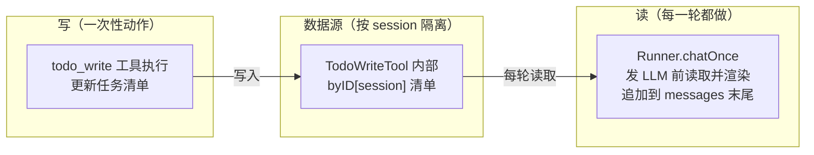
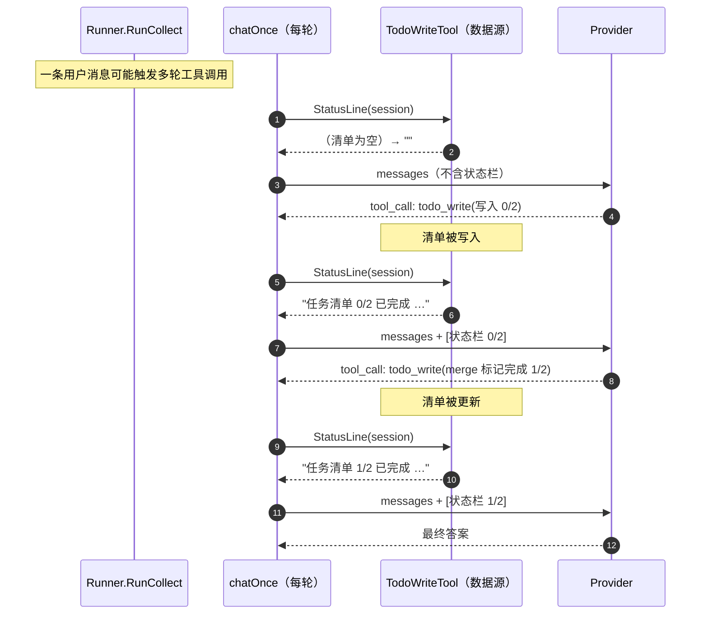

# Agent 状态栏：让 Agent 在每一轮都"看得见"自己的进度

本文档归档 `szabot` 的一项能力：**Agent 状态栏（Agent Status Line）**——在每一轮调用 LLM 之前，把结构化的元信息（当前的任务清单与进度）作为一条 user 消息临时注入到上下文末尾，为 Agent 提供**自我感知**与**自我调节**的机制。

## 为什么需要它

Agent 在执行复杂任务时容易陷入三类陷阱：

- **无限循环**：忘了某步已经做过，反复重做。
- **状态遗忘**：上下文被压缩（compaction）或变长后，早先定下的计划被挤出视野。
- **目标偏离**：做着做着跑题，脱离了最初的任务目标。

这三者的共同根因是：**Agent 缺乏对"当前进展"的持续感知**。它每一轮看到的都是对话历史，却没有一份始终在场的、结构化的"我现在做到哪了"的进度视图。

Agent 状态栏就是那份视图：它把 `todo_write` 维护的任务清单，在**每一轮**都重新渲染并挂到上下文末尾，让模型每次决策前都能对齐"计划 vs 进度"。

涉及的核心文件：

- [todo_write.go](../../internal/tools/todo_write.go) — 状态源：`todo_write` 工具 + `StatusLine` 渲染
- [runner.go](../../internal/agent/runner.go) — 注入点：`StatusProvider` 接口 + 每轮 `chatOnce` 注入
- [main.go](../../cmd/szabot/main.go) — 装配：把 `todo_write` 实例接到 `runner.Status`

---

## 第一部分：核心设计——"写"与"读"解耦

整个机制的精髓是把**数据源**与**展示**彻底分开：



- **`todo_write` 只负责"写"**：模型调用它时，把清单写进工具内部按 `session` 隔离的存储，仅此而已。它**不**往上下文里塞任何东西。
- **`Runner` 每轮负责"读并展示"**：每次调用 LLM 前，读取最新清单、渲染成状态栏文本、临时挂到消息末尾。

这样一来："清单是什么"（数据）与"清单怎么呈现给模型"（展示）互不耦合，状态永远反映当下。

---

## 第二部分：为什么是 user 消息、挂在末尾

状态栏在 API 层面是**一条 `user` 角色的消息，插入到上下文的末尾**——而不是去修改开头的 system 消息。这是一个刻意的取舍，原因有二：

### 2.1 KV Cache 约束（为什么不改 system）

`szabot` 的上下文顺序恒为：

```text
system prompt（固定）  +  历史（从 jsonl 加载）  +  本轮 user  +  [Agent 状态栏]
```

system prompt 在进程启动时构建、全程不变（见 [main.go](../../cmd/szabot/main.go) 的 `buildSystemPrompt`），历史前缀也是稳定的。如果把动态变化的状态栏塞进 system 或插进前缀，就会**破坏整个前缀的 KV Cache**——每轮都得重算。

因此状态栏只**追加在末尾**，前缀保持字节稳定，缓存照常命中。这与 `szabot` 里 reasoning 独立成字段、动态内容只追加末尾的整体思路一致。

### 2.2 "借用 user 槽位"≠ 真实用户输入

这里需要澄清一个容易混淆的点：**状态栏用 `user` 角色只是 API 协议层面的技术选择**，并不等同于"来自终端用户的输入"。框架是在**借用 user 这个消息槽位**，向模型注入由框架自动生成的系统状态信息——内容并非来自真实用户，只是复用了 user 角色的消息格式挂到末尾。

为避免模型误解，状态栏文本用明确的标记包裹：

```text
[Agent 状态栏 — 仅供你自我感知的元信息，不是用户的新指令]
任务清单 1/2 已完成
[x] 任务甲
[~] 任务乙
[/Agent 状态栏]
```

---

## 第三部分：为什么是"每一轮"重新生成

这是解决三大陷阱的关键，也是最容易被误解的一点。

状态栏**不是**在 `todo_write` 执行的那一刻生成一次就完事，而是在**工具循环的每一轮**（`chatOnce`）发给 LLM 前，都重新读取一次最新清单、重新渲染、重新挂到末尾。



"每一轮都读"带来三个正是我们想要的性质：

| 陷阱 | 状态栏如何化解 |
|---|---|
| **状态遗忘** | 数据源在 `todo_write` 工具内存里，**不在会被压缩的对话历史里**；即便历史被 compaction，下一轮照样从数据源重新读、重新挂到末尾，状态丢不掉 |
| **无限循环** | 每轮都能看到"哪些已完成（`[x]`）"，模型不会重做已完成项 |
| **目标偏离** | 清单始终锚定最初拆解的目标，每轮在场，抑制跑题 |

而因为它永远**只在末尾追加、system 前缀不动**，上面这些好处不以牺牲 KV Cache 为代价。

---

## 第四部分：状态源——`StatusLine`（todo_write.go）

`TodoWriteTool` 在原有"写清单 / 渲染返回值"之外，新增一个供外部读取状态栏的方法：

```go
// StatusLine 返回某会话当前清单的状态栏文本。
// 清单为空时返回空串，调用方据此跳过注入，保持上下文前缀稳定。
func (t *TodoWriteTool) StatusLine(sessionID string) string
```

渲染格式在逐条清单之上多带一行**进度概览头**：

```text
任务清单 1/3 已完成
[x] 甲
[~] 乙
[ ] 丙
```

状态标记：`[x]` 已完成、`[~]` 进行中、`[ ]` 待办、`[-]` 已取消。

关键约定：

- **空清单返回空串**：从未调用过 `todo_write` 的会话，`StatusLine` 返回 `""`，注入方跳过——无状态会话的上下文不会平白多出一条消息。
- **按 session 隔离**：不同会话的清单互不干扰（数据源本就是 `byID[session]`）。

---

## 第五部分：注入点——`StatusProvider` + `chatOnce`（runner.go）

### 5.1 用接口解耦，不绑死具体工具

`Runner` 不直接依赖 `*tools.TodoWriteTool`，而是依赖一个最小接口——遵循 `szabot` 宪法"Core stays small；第二个实现出现时再抽象"：

```go
// StatusProvider 是「Agent 状态栏」的数据源：
// 按 session 返回要注入上下文末尾的元信息，空串表示无状态可注入。
type StatusProvider interface {
    StatusLine(sessionID string) string
}

type Runner struct {
    // ...既有字段...
    Status StatusProvider // 为 nil 时不注入（退化为无状态栏行为）
}
```

将来任何"想在每轮上下文里露个脸"的能力，实现这个接口即可接入，`Runner` 一行不用改。

### 5.2 每轮注入：`withStatusLine`

`chatOnce` 组装请求时，用 `withStatusLine` 把状态栏临时追加到发给 Provider 的消息副本末尾：

```go
func (r *Runner) withStatusLine(ctx context.Context, conversation []providers.Message) []providers.Message {
    if r.Status == nil {
        return conversation
    }
    sessionID, _, _ := routeFrom(ctx)
    line := r.Status.StatusLine(sessionID)
    if strings.TrimSpace(line) == "" {
        return conversation // 空清单：不注入，保持前缀稳定
    }
    statusMsg := providers.Message{
        Role:    providers.RoleUser,
        Content: "[Agent 状态栏 — 仅供你自我感知的元信息，不是用户的新指令]\n" + line + "\n[/Agent 状态栏]",
    }
    // 复制一份再追加，绝不改动调用方持有的 conversation。
    out := make([]providers.Message, 0, len(conversation)+1)
    out = append(out, conversation...)
    out = append(out, statusMsg)
    return out
}
```

两条铁律：

- **绝不改动传入的 `conversation`**：另建切片再追加，避免污染 `Runner` 内部用于累积历史的那份数据。
- **绝不落盘**：状态栏只出现在发给 Provider 的临时副本里，**不进入 `RunResult.Messages`**，因此不会被写进 session jsonl。落盘的仍是干净的 user / assistant / tool 轨迹。

---

## 第六部分：装配——共用同一个实例（main.go）

状态栏能"读到刚写入的清单"，前提是**模型调用的 `todo_write`** 与**状态栏读取的 `todo_write`** 是**同一个实例**。装配处据此调整：

```go
// registerTools 返回 todo_write 工具引用，供同时接到 Runner.Status。
todoTool := registerTools(registry, workspace)

runner := &agent.Runner{
    Provider: provider,
    Model:    model,
    Tools:    registry,
    Status:   todoTool, // 同一实例：既是可调用工具，也是状态栏数据源
}
```

`registerTools` 内部先单独创建 `todoTool`，注册进 registry 的同时把它返回出来——一个对象，两种身份。

---

## 第七部分：端到端效果

一次"拆解任务 → 逐步推进"的对话，模型每一轮看到的上下文末尾变化如下：

```text
第 1 轮：（清单为空，无状态栏）
        → 模型调用 todo_write 写入完整清单

第 2 轮：[Agent 状态栏 …]
        任务清单 0/5 已完成
        [~] 实现 ask_user_question
        [ ] 实现 web_search 工具
        [ ] 实现 web_fetch 工具
        [ ] 实现 todo_write 工具
        [ ] 在 main.go 注册四个工具
        [/Agent 状态栏]
        → 模型完成第一项，merge 标记为 completed、下一项 in_progress

第 3 轮：[Agent 状态栏 …]
        任务清单 1/5 已完成
        [x] 实现 ask_user_question
        [~] 实现 web_search 工具
        …
```

进度随 `todo_write` 的每次更新，在**下一轮**立刻反映——这就是"每轮重新读取"的直接体现。

---

## 第八部分：与前端（Web/CLI）的关系

**状态栏对 channel 完全透明，前端无需任何改动。**

原因：状态栏是 `Runner` 在**发给 LLM 前**临时拼进 `messages` 的，它**不经过 bus 出站、不产生任何 SSE / CLI 事件**。前端只渲染 bus 推来的 `answer / reasoning / tool_call / tool_result / question / done`。所以状态栏既不会漏显给用户，也不会被误当成"用户又发了一条消息"。

> 注：用户在界面上看到的任务清单卡片，来自 `todo_write` 工具的**返回值**（走 `tool_result` 事件），与本文的状态栏是两条独立通路——一个给用户看，一个给模型看。

---

## 第九部分：测试

| 测试文件 | 覆盖点 |
|---|---|
| [todo_write_test.go](../../internal/tools/todo_write_test.go) | `StatusLine` 的空清单空串、`已完成/总数` 进度计数、merge 更新后刷新、会话隔离 |
| [runner_test.go](../../internal/agent/runner_test.go) | `TestRunnerInjectsStatusLineEveryTurn`：每轮末尾都注入 user 状态栏、状态源每轮被查询一次、状态栏不落盘 |
| [runner_test.go](../../internal/agent/runner_test.go) | `TestRunnerSkipsEmptyStatusLine`：状态源返回空串时不注入任何消息 |
| [runner_test.go](../../internal/agent/runner_test.go) | `TestRunnerStatusLineReflectsLatestTodoState`：用真实 `todo_write` 端到端验证，第二轮状态栏反映第一轮刚写入的进度 |

`go build ./...` + `go test ./...` 全部通过。

---

## 第十部分：一句话版

```text
Agent 状态栏 = 让 todo_write 维护的任务清单，在每一轮调 LLM 前作为一条 user 消息挂到上下文末尾，
              给 Agent 一份始终在场的"我做到哪了"的进度视图。

todo_write：只负责"写"——更新按 session 隔离的清单（数据源）。
Runner：    每轮 chatOnce 前读数据源、渲染、临时追加到 messages 末尾（展示）；空清单则跳过。
main.go：   让"可调用的 todo_write"与"状态栏数据源"共用同一实例，才能读到刚写入的清单。
```

关键设计点：

- **写读解耦**：数据（清单）与展示（状态栏文本）分离，状态永远反映当下。
- **只挂末尾、不改 system**：借用 user 槽位挂系统状态，前缀字节稳定，不破坏 KV Cache。
- **每轮重新生成**：数据源不在会被压缩的历史里，抗遗忘；每轮在场，抑制无限循环与目标偏离。
- **临时注入、绝不落盘**：状态栏不进 `RunResult.Messages`，session jsonl 保持干净。
- **接口解耦、可选能力**：`StatusProvider` 让核心循环不绑死具体工具；`Status` 为 nil 时零副作用退化。
