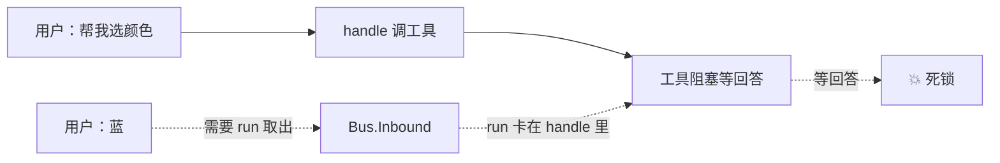
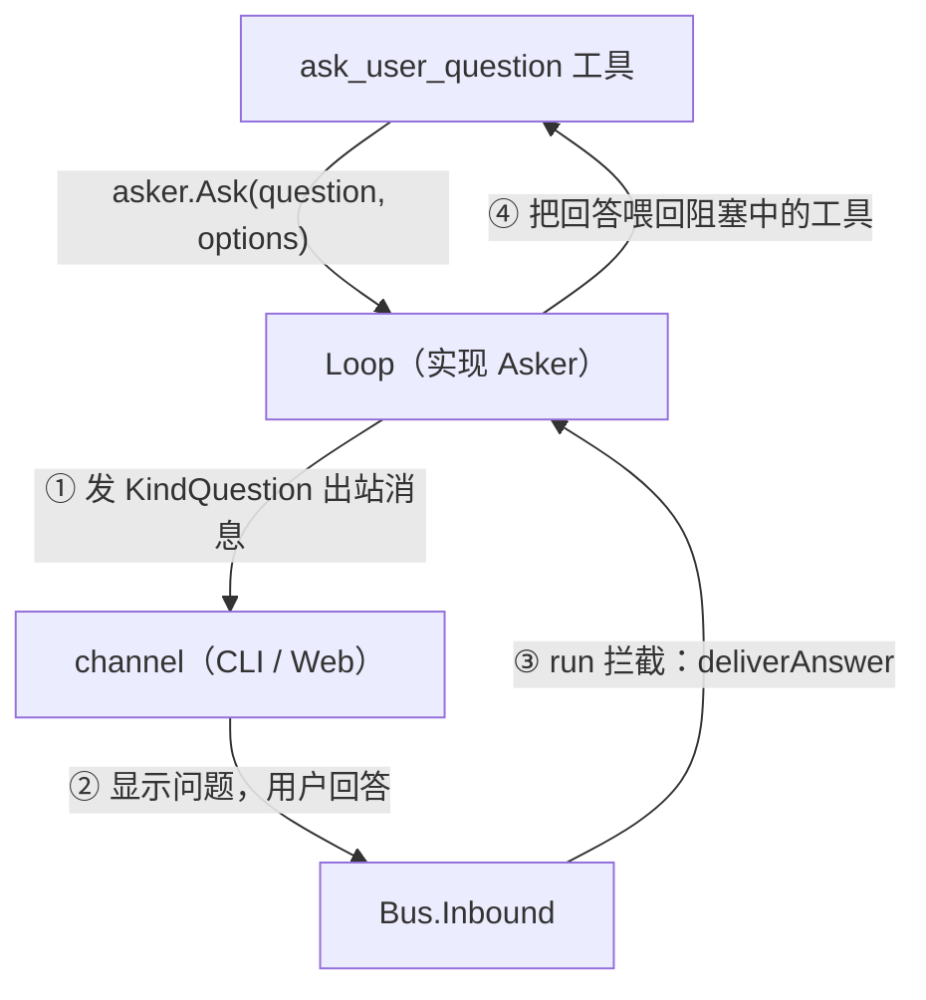
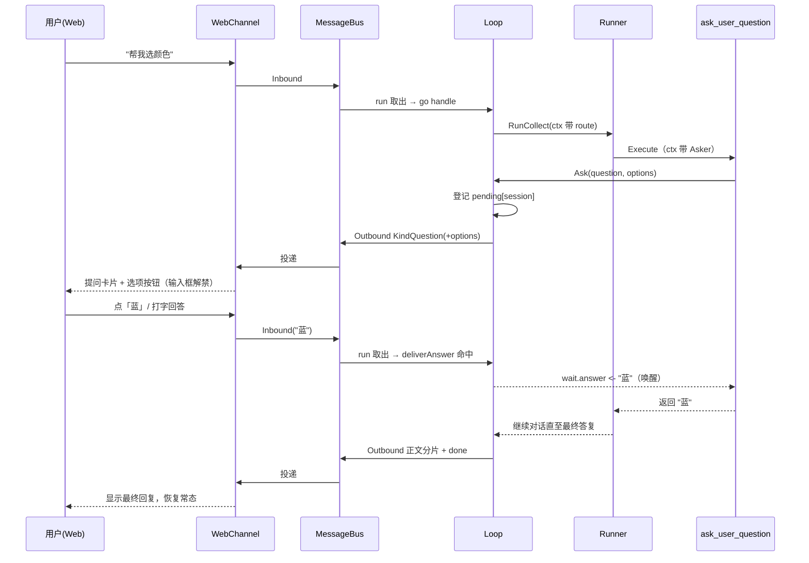

# 本次改动总结：ask_user_question 交互工具 + Web 交互体验优化

本文档归档一次连续迭代中对 `szabot` 所做的一项能力补齐：**新增 `ask_user_question` 工具，让 agent 能在任务执行中途「暂停、向用户提问、等到回答后再继续」**，并把它的 Web 界面交互从「无法回答」修好到「醒目提问卡片 + 可点击选项 + 输入框即时可用」。

在此之前，szabot 的数据流是**单向**的：一条用户消息进来 → agent 处理 → 一条回复出去。工具的 `Execute` 只能返回一个字符串，没有任何机制让工具在执行到一半时「反问用户并阻塞等待」。

涉及的核心文件：

- [ask_user_question.go](../../internal/tools/ask_user_question.go) — 新增工具本体 + `Asker` 接口 + 通过 ctx 传递 Asker
- [loop.go](../../internal/agent/loop.go) — `Loop` 实现 `Asker`（bus 双向通道）：`Ask` / `pending` / `deliverAnswer`，`run` 改为 goroutine 处理
- [runner.go](../../internal/agent/runner.go) — 执行工具前把 `Asker` 与 `SessionID` 注入 ctx
- [asker.go](../../internal/agent/asker.go) — 通过 ctx 传递「回信地址」(SessionID/ChannelID)
- [events.go](../../internal/bus/events.go) — `OutboundMessage` 新增 `KindQuestion` 出站类型
- [web.go](../../internal/channels/web.go) — SSE 载荷透出结构化 `options`
- [web/index.html](../../internal/channels/web/index.html) — 前端提问卡片、选项按钮、输入框即时解禁

---

## 第一部分：问题背景

### 1.1 需求

很多任务需要 agent 先跟用户确认再动手，例如「你想要哪种颜色？」「删除前请确认」。这要求一种能力：

> 工具执行到一半 → 把问题发给用户 → **阻塞等待** → 拿到用户回答 → 带着回答继续。

### 1.2 为什么不能简单实现

有两处根本矛盾：

**矛盾 A：工具只能返回字符串，答案却在用户脑子里。**

`Tool.Execute(ctx, args) (string, error)` 是固定接口，它无法「停下来等一条还没发生的用户输入」。

**矛盾 B：`run` 循环是单线程串行的，直接阻塞会自锁。**

改动前 `Loop.run` 这样消费消息：

```go
for {
    in := <-Bus.Inbound()   // 取一条消息
    l.handle(ctx, in)       // 同步处理完，才回来取下一条
}
```

如果工具在 `handle` 里阻塞等回答，而那条回答又必须靠同一个 `run` 循环 `<-Bus.Inbound()` 取出来才能送达——`run` 正卡在 `handle` 里出不来，就形成死锁：



---

## 第二部分：解决方案总览

沿用项目既有的「能力挂在边上、Core stays small」风格，用一条**基于 bus 的双向通道**把「提问 / 回答」打通，工具本身完全不碰 stdin / 平台细节：



核心设计：**把「提问」当成一次普通出站消息，把「用户的回答」当成一次普通入站消息**，让 channel 继续当唯一的「输入输出翻译官」。这样 CLI 一行不用改，Web / 未来任何 channel 都天然复用。

---

## 第三部分：实现细节

### 3.1 Asker 接口（放在 tools 包，避免 import 循环）

工具依赖「提问」这一抽象能力，具体实现在 `agent.Loop`。接口定义在 tools 包，agent 包实现它、Runner 注入它：

```go
// internal/tools/ask_user_question.go
type Asker interface {
    // options 为空表示开放式回答；非空供 channel 渲染成可点击选项。
    Ask(ctx context.Context, question string, options []string) (string, error)
}
```

工具的 `Execute` 只做一件事——调用 ctx 里注入的 `Asker`：

```go
asker, ok := askerFrom(ctx)
if !ok {
    return "", fmt.Errorf("ask_user_question: no interactive channel available")
}
answer, err := asker.Ask(ctx, question, cleanOptions(args.Options))
```

`Asker` 通过 `context` 注入，从而不必改变 `Tool.Execute` 的签名：

```go
func WithAsker(ctx context.Context, asker Asker) context.Context { ... }
func askerFrom(ctx context.Context) (Asker, bool) { ... }
```

### 3.2 Loop 实现 Asker：pending + deliverAnswer

`Loop` 里维护一张「正在等回答」的表（按 SessionID）：

```go
type Loop struct {
    // ... Store / SystemPrompt ...
    mu      sync.Mutex
    pending map[string]*pendingAsk
}
type pendingAsk struct { answer chan string }
```

`Ask`：登记 pending → 把问题作为 `KindQuestion` 出站消息发出 → 阻塞等回答：

```go
func (l *Loop) Ask(ctx context.Context, question string, options []string) (string, error) {
    sessionID, channelID, _ := routeFrom(ctx)      // 回信地址从 ctx 取
    wait := &pendingAsk{answer: make(chan string, 1)}
    l.mu.Lock(); l.pending[sessionID] = wait; l.mu.Unlock()
    defer func() { /* 退出时清理登记，避免 session 永久卡住 */ }()

    out := bus.OutboundMessage{
        SessionID: sessionID, ChannelID: channelID,
        Text: renderQuestion(question, options), // 文本含选项（CLI 用）
        Kind: bus.KindQuestion,
    }
    if len(options) > 0 {
        out.Meta = map[string]any{"options": options} // 结构化（Web 用）
    }
    l.Bus.PublishOutbound(ctx, out)

    select {
    case <-ctx.Done():         return "", ctx.Err()
    case answer := <-wait.answer: return answer, nil
    }
}
```

`run` 循环里先拦截回答，再决定是否当新消息处理；并把 `handle` 改为 goroutine 解死锁：

```go
if l.deliverAnswer(in.SessionID, in.Text) {
    continue // 这是对提问的回答，喂给等待中的工具，不送 LLM
}
go l.handle(ctx, in) // 独立 goroutine，避免提问阻塞消息消费
```

```go
func (l *Loop) deliverAnswer(sessionID, text string) bool {
    l.mu.Lock(); wait, ok := l.pending[sessionID]
    if ok { delete(l.pending, sessionID) }
    l.mu.Unlock()
    if !ok { return false }
    wait.answer <- text // 带缓冲，不阻塞
    return true
}
```

> **关键修复点**：`run` 从 `l.handle(...)`（同步）改为 `go l.handle(...)`（并发）。这是解开「矛盾 B」死锁的核心——让 `run` 循环在工具阻塞等待期间仍能继续消费入站消息，把回答送达。

### 3.3 回信地址随 ctx 传递

工具的 `Execute` 拿不到 SessionID/ChannelID，通过 ctx 传：

```go
// internal/agent/asker.go
func withRoute(ctx, sessionID, channelID) context.Context { ... }
func routeFrom(ctx) (sessionID, channelID string, ok bool) { ... }
```

`handle` 在进入 Runner 前塞入，`Runner.RunCollect` 再把 `Asker` 与 `SessionID` 注入 ctx 供工具读取。

---

## 第四部分：Web 界面交互优化

### 4.1 原来的交互差在哪

1. **最致命**：用户发消息后输入框被禁用（`waiting=true` / `sendBtn.disabled=true`），只有收到 `done` 才解禁。而提问期间工具正阻塞、这一轮**根本不发 `done`** → **问题显示出来了，但输入框一直灰着，用户无法回答**，形成卡死。
2. 问题和普通回复长得一样，用户不知道「该我回答了」。
3. 选项只是纯文本，没有任何可点击交互。

### 4.2 修复：KindQuestion + 结构化 options

**后端**给提问消息打上 `KindQuestion`，并把 `options` 放进 `Meta`，SSE 透传给前端：

```go
// events.go
KindQuestion OutboundKind = "question"
```

```go
// web.go —— SSE 载荷带上结构化选项
if opts, ok := out.Meta["options"].([]string); ok && len(opts) > 0 {
    fields["options"] = opts
}
```

**前端**收到 `kind:"question"` 时：

- 渲染醒目的**提问卡片**（左侧 accent 竖条 + 「需要你的回答」标签）；
- 有选项则渲染成**可点击按钮**，点一下即把该选项作为回答发出，随后禁用防重复点击；
- **立即解禁并聚焦输入框**（不等 `done`），也支持直接打字回答：

```js
if (data.kind === "question") {
    showQuestion(data.text, data.options || []);
    return;
}
// showQuestion 内：
answering = true;
waiting = false;
sendBtn.disabled = false;
input.disabled = false;
input.focus();
```

### 4.3 CLI 天然可用

CLI 直接打印出站消息文本（`renderQuestion` 已把选项拼进文本），用户输入回答即可，无需改动。

---

## 第五部分：实测验证（真实 DeepSeek + Web）

引导 LLM 调用 `ask_user_question` 后，SSE 流正确推送：

```json
{"delta":false,"done":false,"kind":"question",
 "options":["科幻","喜剧","悬疑"],
 "text":"你更喜欢哪种类型的电影呢？\n可选项：\n  1. 科幻\n  2. 喜剧\n  3. 悬疑\n（可直接回复选项序号或内容）"}
```

发送回答「科幻」后：回答被 `deliverAnswer` 正确拦截喂回工具（未当成新问题）→ LLM 继续给出电影推荐 → `done` 收尾。

- `go build` / `go vet` ✓
- `go test`（含 `-race`，agent / tools / channels 三包）全绿 ✓

---

## 附：一次完整时序


