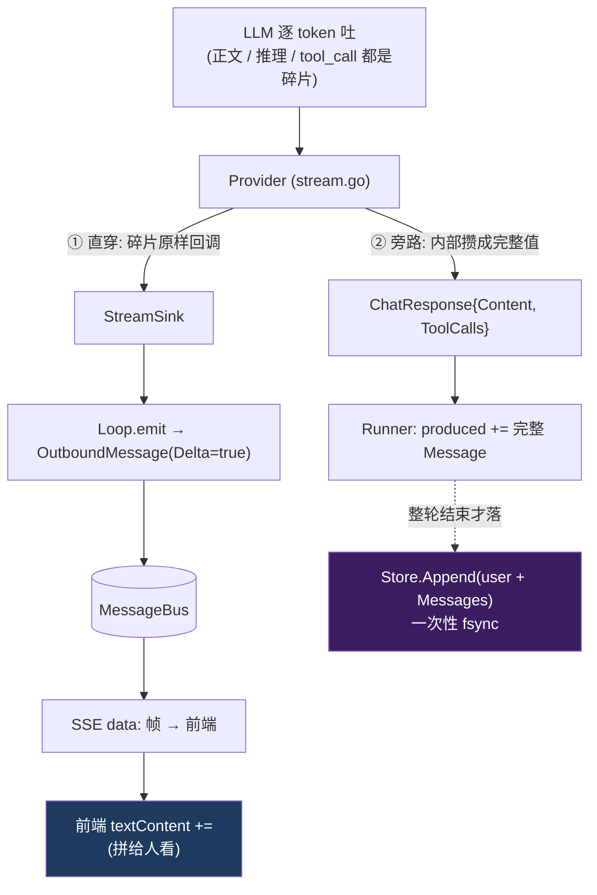
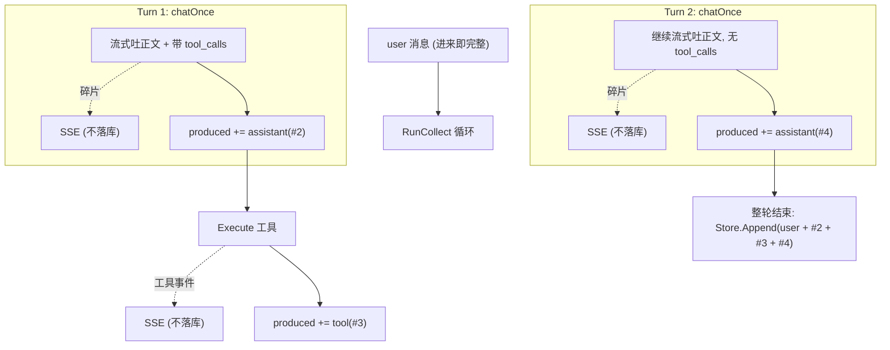

# 直穿 + 旁路：流式展示与持久化的双路分离

本文档归档 `szabot` 处理一轮对话时的核心数据流设计：**同一份 LLM 输出，被分成两条互不依赖的路——一条"直穿"实时推给前端展示，一条"旁路"聚合成完整消息用于持久化与下一轮上下文。** 二者同源于 `Runner`/`Provider`，但载体、粒度、可靠性、拼装方式与落库时机全然不同。

理解这条设计，就能回答几个高频疑问：

- 为什么前端看到的是几十条碎片，而 jsonl 里只有几条完整消息？
- 流式文本推了一半、中途调了工具，最终落库几条什么样的消息？
- SSE 上的 `tool_call` 那条 text 是 LLM 吐的原文吗？
- 文本到底在哪里被"拼"成完整的？

涉及的核心文件：

- [stream.go](../../internal/providers/stream.go) — Provider 层：边透传碎片、边在内部攒完整 `Content`/`ToolCalls`
- [runner.go](../../internal/agent/runner.go) — Runner：直穿回调 `StreamSink` + 旁路累积 `produced`
- [loop.go](../../internal/agent/loop.go) — Loop：`emit` 推 SSE + 整轮结束 `Store.Append` 落库
- [session.go](../../internal/agent/session.go) — 持久化：jsonl + fsync
- [web.go](../../internal/channels/web.go) — SSE 分片下发
- [web/index.html](../../internal/channels/web/index.html) — 前端把 delta 碎片拼进 DOM

---

## 第一部分：一个分叉点，两条路

关键分叉发生在 `Runner`/`Provider`。每产生一段输出，**同时做两件独立的事**：



| 维度 | ① 直穿路（→ 前端） | ② 旁路（→ 持久化） |
|---|---|---|
| 载体 | `bus.OutboundMessage`（分片） | `[]providers.Message`（完整消息） |
| 粒度 | 每个 token 分片，几十上百条 | 每轮几条聚合消息 |
| 时机 | 边生成边推，实时 | 整轮结束一次性写 |
| 目的地 | SSE → 浏览器 | jsonl 文件 |
| 可靠性 | **允许丢**（队列满就丢弃） | **不能丢**（fsync 保证） |
| 内容形态 | 人类可读文本 | 结构化字段 |

**两条路的哲学**：前端要"快"，存储要"全"，二者要求矛盾，所以分两条路各自优化，谁也别拖累谁。

---

## 第二部分：直穿路——为什么敢丢包

直穿路从产生到显示一路无阻，不经任何存储、不做聚合。`stream.go` 里每收到一段增量就立刻回调：

```211:217:internal/providers/stream.go
if choice.Delta.Content != nil && *choice.Delta.Content != "" {
    delta := *choice.Delta.Content
    content.WriteString(delta)
    if err := onChunk(StreamChunk{ContentDelta: delta}); err != nil {
        return ChatResponse{}, err
    }
}
```

碎片一路流到 SSE 订阅者时，是**允许丢弃**的：

```132:148:internal/channels/web.go
for _, s := range targets {
    select {
    case s.events <- out:
    default:
        // 订阅者的队列满了（前端消费不过来）就丢弃这一条，
        // 保证 dispatch 永不阻塞，不拖垮整个出站链路。
    }
}
```

**为什么敢丢**：直穿路只负责"实时显示"，丢一条分片顶多显示上少一小段，**不影响最终落库的完整性**——完整性由旁路独立保证。这就是"直穿"敢于如此激进的底气。

---

## 第三部分：旁路——完整消息在哪里拼成的

这是最容易误解的一环。**拼装的活儿主要发生在 Provider 层（`stream.go`），而不是 Runner 的 `produced` 累积那一步。**

`ChatStream` 在流式回调的**同时**，用几个累加器在内部把碎片攒成完整值：

```160:163:internal/providers/stream.go
var content strings.Builder
var reasoning strings.Builder
tools := newToolCallAccumulator()
finishReason := ""
```

- **正文/推理**：`content.WriteString(delta)` 边推边攒，最后 `content.String()` 就是完整正文；
- **tool_calls**：按 `index` 累积（`id`/`name` 一般只在首片出现，`arguments` 逐片拼接）：

```66:83:internal/providers/stream.go
func (a *toolCallAccumulator) add(delta openAIStreamToolCall) {
    call, ok := a.byIdx[delta.Index]
    if !ok {
        call = &ToolCall{}
        a.byIdx[delta.Index] = call
        a.args[delta.Index] = &strings.Builder{}
        a.order = append(a.order, delta.Index)
    }
    if delta.ID != "" {
        call.ID = delta.ID
    }
    if delta.Function.Name != "" {
        call.Name = delta.Function.Name
    }
    if delta.Function.Arguments != "" {
        a.args[delta.Index].WriteString(delta.Function.Arguments)
    }
}
```

流结束后，`ChatResponse` 一次性带出所有攒好的完整值：

```244:249:internal/providers/stream.go
return ChatResponse{
    Content:      content.String(),
    Reasoning:    reasoning.String(),
    ToolCalls:    toolCalls,
    FinishReason: finishReason,
}, nil
```

因此 Runner 拿到的 `response.Content`/`response.ToolCalls` **已经是完整的**，旁路只是把它 `append` 进 `produced`，**自己不用再拼**：

```161:168:internal/agent/runner.go
assistant := providers.Message{
    Role:      providers.RoleAssistant,
    Content:   response.Content,
    Reasoning: response.Reasoning,
    ToolCalls: response.ToolCalls,
}
conversation = append(conversation, assistant)
produced = append(produced, assistant)
```

---

## 第四部分：文本被"拼"了两次（两条路各拼各的）

同一段正文，为两个不同目的、在两个地方各自拼一次。这是理解"直穿 vs 旁路"的关键：

| 内容 | 谁拼成完整 | 给谁用 |
|---|---|---|
| 正文（给前端显示） | **前端** `textContent +=` | 实时显示 |
| 正文（给存库/上下文） | **Provider 内部** 攒成 `response.Content` | 旁路 `produced` 直接用 |
| tool_calls | **Provider 内部** 攒成完整 `ToolCall` | Runner 执行 + 旁路存 |

前端这一侧的"拼"：

```262:264:internal/channels/web/index.html
currentAnswerBubble.textContent += text;   // 前端把碎片拼进 DOM
lastTypedKind = kind;
```

**结论**：文本确实需要拼——给前端看的那份是**前端**拼的；给存库/上下文的那份是 **Provider 内部**拼的，旁路直接拿来用。同一份 token 流，Provider 分给了两条路：碎片流给前端、完整值给存储。

---

## 第五部分：正文 vs 工具调用——为什么处理不同

底层上，**正文和 tool_calls 都是 LLM 逐 token 吐的碎片**。区别不在"是否流式"，而在 Provider **拿到碎片后怎么处理**：

| | 正文（answer/reasoning） | tool_calls |
|---|---|---|
| Provider 处理 | 碎片**边到边透传**给前端 | 碎片**攒齐拼完整**后才交出 |
| 前端所见 | 几十条 `{kind:answer}` 分片 | **1 条**完整的 tool_call |
| 原因 | 半段文本能显示，体验好 | 半段 `arguments`（如 `{"que`）无法解析、无法执行 |

工具参数必须完整才能用，所以 Provider 攒齐后还会**校验** `ID`/`Name` 齐全，再随 Done chunk 一次性交出：

```229:242:internal/providers/stream.go
toolCalls := tools.finish()
for _, call := range toolCalls {
    if call.ID == "" {
        return ChatResponse{}, errors.New("provider: streamed tool call is missing an ID")
    }
    if call.Name == "" {
        return ChatResponse{}, errors.New("provider: streamed tool call is missing a function name")
    }
}
// 结束标记：把累积到的 tool_calls 一并交出，便于上层在一处处理。
if err := onChunk(StreamChunk{Done: true, ToolCalls: toolCalls, FinishReason: finishReason}); err != nil {
    return ChatResponse{}, err
}
```

### 重要澄清：SSE 上的 `tool_call` text 不是 LLM 原文

你在 SSE 里看到的：

```
{"delta":true,"done":false,"kind":"tool_call","text":"web_search({\"query\": \"字节跳动公司 简介\"})"}
```

这里的 `text` **不是 LLM 吐的文字**，而是 szabot 把结构化的 `ToolCall{ID,Name,Arguments}` 用 `formatToolCall` **拼成的人类可读字符串**：

```200:206:internal/agent/loop.go
func formatToolCall(call providers.ToolCall) string {
    args := string(call.Arguments)
    if args == "" || args == "null" {
        return call.Name + "()"
    }
    return call.Name + "(" + args + ")"
}
```

对比：`kind:"answer"`/`"reasoning"` 的 text 是 LLM 真吐的原文（原样透传）；而 `kind:"tool_call"`/`"tool_result"` 的 text 是对结构化数据的**可读化渲染**——注意这个拼串过程还**丢弃了 `call.ID`**（这也是当前 SSE 格式尚不能对接 AG-UI 标准的原因之一）。

---

## 第六部分：完整实例——推文本一半 + 调工具 + 继续文本

场景：用户"帮我看看 README 里写了啥"，模型先流式吐半段话并调用 `read_file`，工具返回后继续总结。

在 OpenAI 兼容协议下，"吐正文 + 调工具"是**一次**模型调用（同轮既有 content 又有 tool_calls），"工具后继续文本"是**下一次**调用。所以这是**两个 turn**：



**最终落库 4 条**（jsonl 行序）：

```json
{"role":"user","content":"帮我看看 README 里写了啥"}
{"role":"assistant","content":"好的，我先读一下 README。","toolCalls":[{"id":"call_a1","name":"read_file","arguments":{"path":"README.md"}}]}
{"role":"tool","toolCallId":"call_a1","content":"# szabot ...（文件内容）"}
{"role":"assistant","content":"README 介绍了 szabot 是一个轻量级本地 AI agent……"}
```

| # | Role | 内容 | 何时认定完整 |
|---|---|---|---|
| 1 | `user` | 用户输入 | 请求进来即完整 |
| 2 | `assistant` | Turn 1 正文（推了一半那段的**完整值**）+ `toolCalls` | Turn 1 `chatOnce` 返回 |
| 3 | `tool` | 工具结果，`toolCallId` 关联 #2 | `Execute` 返回 |
| 4 | `assistant` | Turn 2 的最终正文 | Turn 2 `chatOnce` 返回 |

关键点：

- **"推了一半的文本"不会以半截落库**——它作为 #2 的 `content` 完整字段保存（Turn 1 返回时 Provider 已把碎片攒成完整正文）。
- 前端在流式期间收到几十条 `delta` 分片，jsonl 里**一条分片都没有**，只有这 4 条聚合消息。
- 落库是"整轮一次性 fsync"，由 `Loop` 在 `RunCollect` 返回后一次 `Store.Append` 全部写入：

```159:166:internal/agent/loop.go
if l.Store != nil {
    history := make([]providers.Message, 0, len(result.Messages)+1)
    history = append(history, userMsg)
    history = append(history, result.Messages...)
    if err := l.Store.Append(in.SessionID, history...); err != nil {
        log.Printf("[loop] append session=%s error: %v", in.SessionID, err)
    }
}
```

---

## 第七部分：三类消息的"完整"边界

| 消息 | 认定"完整"的时机 |
|---|---|
| **用户消息** | 请求一进来即完整（本就是收完的输入） |
| **助手消息** | **一次 `chatOnce`（模型调用）彻底返回**时。流式推了一半**不算**完整——要等该轮拿到完整的 `Content`+`Reasoning`+`ToolCalls` |
| **工具结果** | **`Tools.Execute` 返回**时 |

其中助手消息在**无 tool_calls**（终轮）时，收进 `produced` 即整轮结束：

```149:156:internal/agent/runner.go
if len(response.ToolCalls) == 0 {
    answer := providers.Message{
        Role:      providers.RoleAssistant,
        Content:   response.Content,
        Reasoning: response.Reasoning,
    }
    produced = append(produced, answer)
    return RunResult{Answer: response.Content, Messages: produced}, nil
}
```

---

## 第八部分：与显式取消的关系

因为持久化是"整轮结束才落库"，若请求中途被显式取消或因进程关停而取消（见 [disconnect-cancellation.md](../harness/disconnect-cancellation.md)）：

- `RunCollect` 带 `context.Canceled` 提前返回 → `handle` 直接 `return` → **跳过旁路的 `Store.Append`** → 这一轮消息（含 user）**一条都不落库**；
- 但直穿路**已推给前端的分片仍留在浏览器屏幕上**（前端 DOM，服务端不管）。

所以被取消的半截是"**前端看得到、历史里没有**"。这通常正是想要的（没答完的别污染上下文）。若要"重连后接着看断连前的内容",需让旁路支持"边产出边落 + 缓冲 + `Last-Event-ID` 续传"——那是另一套设计。

---

## 小结

- **一份 LLM 输出，两条路**：直穿（碎片 → SSE → 前端，允许丢、求实时）；旁路（完整消息 → 内存聚合 → 整轮 fsync 落库，不能丢、求完整）。
- **拼装主要在 Provider 层**：`stream.go` 边透传碎片、边用累加器攒完整 `Content`/`ToolCalls`；旁路直接用攒好的完整值，前端则自己把碎片拼进 DOM。
- **正文 vs 工具调用**：都是 LLM 逐 token 吐的，但正文碎片边到边透传、工具调用碎片攒齐才交出（半段参数无法执行）。
- **SSE 上的 `tool_call` text 是拼出来的展示串**，不是 LLM 原文，且丢了 `toolCallId`。
- **一轮落几条**：以"一次模型调用 / 一次工具执行"为完整边界聚合，整轮结束一次性落库；示例场景落 4 条（`user` + `assistant(正文+toolCall)` + `tool` + `assistant`）。
