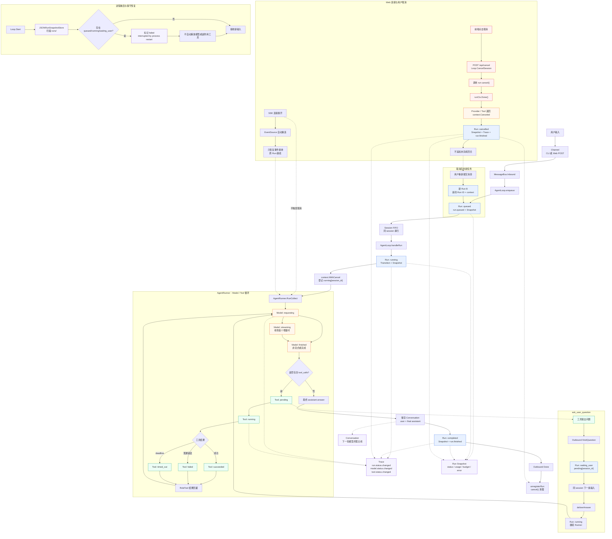

# yomi 三层 Agent 状态机

本文定义 yomi 逐步引入的三层状态模型，用于统一任务生命周期、模型调用和工具执行的语义。三层状态服务于不同粒度，不应混成一个枚举。

## 设计目标

- 让一次 Agent 任务的生命周期可查询、可解释、可恢复。
- 让模型请求和工具调用的失败原因可以独立排查。
- 让 Trace、取消、超时、预算和 UI 使用一致的状态语义。
- 保持 Conversation 只保存模型需要的对话主线，内部状态写入 Trace。

## 完整生命周期总图

下面这张图把当前实现中的正常执行、用户提问、Web 显式取消、SSE 重连和进程重启放在同一张图中。实线表示正常执行路径，虚线表示取消、持久化或恢复相关路径。



图中最重要的边界是：`Run: cancelled` 是旧任务的终态；重连只恢复连接，不会让旧 Run 重新进入 `running`。用户再次提交消息时，系统创建新的 Run B。

## 三层职责

### Run 状态：任务级

Run 表示一次用户任务的整体生命周期。当前 yomi 已有 `RunStatus`，其转换规则由 `Run.Transition` 集中管理。

```text
queued -> running -> waiting_user -> running -> completed
                     |             |
                     +-> failed    +-> cancelled
                     +-> timed_out
                     +-> budget_exceeded
```

终态为 `completed`、`failed`、`cancelled`、`timed_out` 和 `budget_exceeded`。终态不能再次进入执行态。

### Model 状态：模型请求级

Model 状态表示一次 Provider 请求：

```text
idle -> requesting -> finished
                  \-> streaming -> finished
                  \-> errored
```

Model 状态主要写入 Trace，用于记录请求耗时、首 token 延迟、聚合后的模型消息和 Provider 错误，不写入 Conversation；正文和 reasoning 的实时 delta 只发送给 Channel。

### Tool 状态：工具调用级

Tool 状态表示一次具体工具调用：

```text
pending -> running -> succeeded
                   \-> failed
                   \-> timed_out
```

工具失败不必然意味着 Run 失败。Runner 应按当前约定把错误结果回灌给模型，由模型决定是否修正。

## 状态转换规则

当前通过 `Run.Transition` 统一 Run 状态变更，并在 Runner 内对 Model/Tool 的状态转换进行校验。Loop 将三层状态变化写入 Trace。

每次状态转换应具备：

- 当前状态和目标状态；
- 转换原因；
- 时间戳；
- 对应 Trace 事件；
- 必要的取消、清理或恢复动作。

禁止的例子：

```text
completed -> running
cancelled -> running
failed -> completed
```

## 典型流程

```text
Run: queued
  -> Run: running
  -> Model: requesting
  -> Model: streaming
  -> Model: finished
  -> Tool: pending
  -> Tool: running
  -> Tool: succeeded
  -> Model: requesting
  -> Run: completed
```

用户提问时：

```text
Run: running
  -> Run: waiting_user
  -> 用户回答
  -> Run: running
  -> Run: completed
```

取消时：

```text
Run: running -> cancelled
  -> cancel context
  -> 中断 Model / Tool
  -> 清理 pending 和 running registry
  -> 写入最终 Trace
```

## 实施阶段

1. [x] 集中管理 `RunStatus` 的合法转换，禁止调用方直接赋值。
2. [x] 给 `ModelCallEvent` 和 `ToolExecutionEvent` 增加状态字段。
3. [x] 在 Trace 中关联 `run_id`、模型 step、tool call ID 和状态。
4. [x] 统一取消、超时、预算超限和错误到 Run 终态的映射。
5. [x] 增加 Run 快照和保守的中断恢复策略；副作用工具默认不自动重放。
6. [x] 增加三层状态的 UI 展示和跨运行查询（第一版）。

当前 Trace 状态事件包括：

```text
run.status.changed
model.status.changed
tool.status.changed
```

## UI 展示和跨运行查询

第一版已经把 Run Snapshot 接到 Web Trace 工作台：

```text
GET /api/runs?session=<session_id>
GET /api/runs?session=<session_id>&status=cancelled
GET /api/traces/run?run_id=<run_id>
```

`/api/runs` 以 Snapshot 为主数据源，因此可以返回没有完整 Trace 的 `failed/interrupted` Run。每个 Run 摘要包含：

- Run 状态、状态原因和错误；
- Model 当前状态；
- 每个 tool call 的当前状态；
- Model/Tool 调用次数；
- queued/started/finished/updated 时间；
- Trace event 数量。

Web Trace 页面增加了 Run 状态筛选：`running`、`waiting_user`、`completed`、`failed`、`cancelled`、`timed_out` 和 `budget_exceeded`。选中 Run 后，页面同时显示 Run、Model、Tool 三层状态摘要，再展开具体时间线。

当前第一版的查询范围以 session 为主，尚未实现全局的时间范围、Provider、工具名和成本排序查询；这些可以在 Snapshot Store 增加索引后继续扩展。

Run 快照由可选的 `RunSnapshotStore` 持久化。yomi 的 JSON 实现每个 Run 使用一个 JSON 文件（正常状态保存采用原子替换），记录 Run 状态、预算、usage、时间和错误原因。Loop 在排队、启动、等待用户、恢复和结束时更新快照；默认入口将其保存在 session 根目录的 `runs/` 下。

## 恢复原则

Conversation 只保存下一轮模型需要的消息；Trace 保存完整模型、工具和状态事件；Run Snapshot 保存任务级状态。进程重启时，Snapshot Store 会把未完成的 `queued`、`running`、`waiting_user` Run 标记为 `failed`，原因是 `interrupted by process restart`。第一版不自动重放 `write_file`、`edit_file`、`bash`、`python` 等有副作用的工具。

可安全重试的读取类工具和有副作用的写入类工具应采用不同策略。

## AgentLoop 的完整状态流程

一次用户输入经过以下链路：

```text
Channel
  -> MessageBus.Inbound
  -> AgentLoop.enqueue
  -> Run queued
  -> AgentLoop.drainSession
  -> Run running
  -> context.WithCancel
  -> running[session_id] = cancel handle
  -> AgentRunner.RunCollect
  -> Provider / Tool 多轮执行
  -> Conversation、Trace、Run Snapshot
  -> MessageBus.Outbound
```

### 入队和开始执行

`AgentLoop.enqueue` 创建 `NewRun`，把 Run 放进 session FIFO 队列，写入 `run.queued`，并保存 `queued` Snapshot。同一 session 串行，不同 session 可以并行。

`drainSession` 取出队首任务后，`handleRun` 执行：

```text
queued -> running
```

Loop 同时完成：

1. 调用 `Run.Transition`。
2. 写入 `run.status.changed`。
3. 更新 Run Snapshot。
4. 用 `context.WithCancel` 派生本次 Run 的 context。
5. 登记 `running[session_id] = cancel`。
6. 将 session route 和 Run 放入 Runner context。

```go
runCtx, cancel := context.WithCancel(ctx)
handle := &runHandle{run: run, cancel: cancel}
l.registerRun(sessionID, handle)
defer l.unregisterRun(sessionID, handle)
```

### AgentRunner 执行

Runner 以“模型请求 -> 工具执行 -> 模型请求”的循环运行：

```text
Run running
  -> Model requesting
  -> Model streaming/finished
  -> 无 tool call：Run completed
  -> 有 tool call：Tool pending/running/terminal
  -> tool result 回灌
  -> 下一次 Model requesting
```

模型和工具状态通过 `StreamSink` 回调给 Loop，Loop 将结构化状态和完整消息写入 Trace；正文、推理、tool call 和 tool result 继续通过 Outbound Bus 推给 Channel，其中正文和推理 delta 不持久化。

### 正常完成和失败完成

没有 tool call 的最终模型回复会导致：

```text
Runner 返回 RunResult
  -> 保存 user + final assistant 到 Conversation
  -> running -> completed
  -> 保存 completed Snapshot
  -> 写入 run.finished
  -> 发送 Outbound Done
  -> unregisterRun
```

Runner 错误由 Loop 映射为：

| 错误 | Run 状态 |
| --- | --- |
| `ErrBudgetExceeded` | `budget_exceeded` |
| `context.DeadlineExceeded` | `timed_out` |
| `context.Canceled` | `cancelled` |
| 其他错误 | `failed` |

失败时不把未完成的回合追加到 Conversation；错误、状态原因、Trace 和 Snapshot 仍然保留。

## 用户取消处理

### Web 断连不取消 Run

Web 使用 SSE 接收输出。刷新、切后台、网络切换和代理重连都可能造成 SSE 断开，因此 `WebChannel` 只移除当前订阅者，EventSource 会自动重连；它不会启动取消计时器，也不会调用 `Loop.CancelSession`。

```text
SSE 订阅者断开
  -> 移除订阅者
  -> EventSource 自动重连
  -> 原 Run 继续执行
```

同一 session 有多个 tab 时，每个订阅者独立加入和移除，断开一个不会影响其他连接。

### `CancelSession` 的实际行为

`Loop.CancelSession(sessionID)` 的逻辑是：

1. 取出 `running` registry 中该 session 的 cancel function。
2. 调用 `cancel()`，让取消沿 context 向下传播。

```text
cancel()
  -> runCtx.Done()
  -> Provider.Chat / ChatStream 收到 cancellation
  -> AgentRunner 返回 context.Canceled
  -> AgentLoop 映射 Run cancelled
  -> 保存 Snapshot + Trace
  -> unregisterRun
```

取消依赖 Provider 和 Tool 正确监听 `ctx.Done()`；如果外部实现忽略 context，yomi 无法强制中断它。

Web 当前通过 `POST /api/cancel` 提供独立的“取消当前 Run”API，前端的“取消”按钮调用该接口。SSE 断连、重连和页面刷新都不会触发它。CLI 的 `Ctrl+C` 取消的是进程级 context，会影响所有正在运行的 session，而不是单个 Run。

### `ask_user_question` 的等待态

工具提问时：

```text
Run running
  -> 发布 KindQuestion
  -> Run waiting_user
  -> pending[session_id] = answer channel
```

同 session 的下一条输入会被 `deliverAnswer` 直接送入 pending channel，而不是创建新 Run：

```text
Inbound answer
  -> deliverAnswer(session_id, text)
  -> Tool 收到回答
  -> waiting_user -> running
  -> AgentRunner 继续下一轮模型调用
```

显式调用 `CancelSession` 时，即使 Run 正在等待 `ask_user_question` 的回答，也会结束该 Run。进程退出或 Run 自身超时同样会结束等待。

## 用户取消后重新连接、再次中断和恢复

### SSE 断开后重连

```text
SSE 断开
  -> 移除订阅者
  -> 同 session 重连
  -> 恢复事件接收
  -> 原 Run 继续执行
```

这不是“取消后恢复”，而是 Run 从未因连接变化而取消。Run ID、context 和 Snapshot 都保持不变。

### 显式取消后再重连

如果用户点击“取消”：

```text
CancelSession
  -> running -> cancelled
  -> Runner 返回 context.Canceled
  -> 保存 cancelled Snapshot
  -> 未完成回合不写入 Conversation
```

之后重新建立 SSE 只恢复事件接收，不会让已取消 Run 继续执行，因为 `cancelled` 是终态，旧 context、Runner 和工具链都已结束。

用户重新提交消息时会创建新的 Run：

```text
新消息
  -> 新 Run B queued -> running
  -> 使用同 session 已成功落盘的历史
  -> 产生新的 Run ID 和新的 cancel function
```

旧 Run A 保留为 `cancelled`，不会被重新修改。

### 新 Run 再次取消

如果新 Run B 又开始执行并再次被用户取消，流程独立重复：

```text
Run B running
  -> CancelSession
  -> 只取消 Run B
```

已经终态的 Run A 不在 `running` registry 中，不会被再次取消。

### 进程重启

启动时 `JSONRunSnapshotStore.MarkInterrupted()` 扫描 `runs/`：

```text
queued/running/waiting_user Snapshot
  -> failed
  -> status_reason = interrupted by process restart
```

这是“标记中断”，不是自动续跑。当前不会根据 Snapshot 自动重新调用模型，也不会自动重放 `write_file`、`edit_file`、`bash` 或 `python`。

### 当前恢复边界

当前已经支持：

- SSE 断连后重连，原 Run 继续执行。
- 取消沿 context 中断 Provider/Tool。
- 取消后将 Run 标记为 `cancelled`。
- 进程重启后将未完成 Snapshot 标记为 `failed/interrupted`。
- 重新提交后创建新的 Run，避免复用已取消 context。

当前尚未支持：

- 取消后从某个 Model step 自动续跑。
- 自动恢复 pending tool call 或 pending question。
- 对写文件、编辑文件、Shell 等副作用工具进行安全重放。
- 将取消前的半截输出自动合并进 Conversation。

真正的“取消后恢复”还需要保存最后完成的 Model step、已完成的 Tool call、工具副作用幂等标识和可重试策略。

## Trace、Snapshot 和 Conversation

```text
Conversation
  = 下一轮模型需要的 user/assistant 主线

Trace
  = Run、Model、Tool 的状态、事件、耗时和取消原因

Run Snapshot
  = 任务级状态、预算、usage、时间和错误
```

典型取消轨迹：

```text
run.status.changed        running
model.request.started     requesting
model.status.changed      streaming
run.status.changed        cancelled
model.request.failed      errored / context canceled
run.finished              cancelled
```

## 验证重点

- 终态不能再次转换。
- Run 取消后不会发起新的模型或工具调用。
- 工具错误会回灌模型，但不会伪造 Run 成功。
- Trace 中事件顺序和状态一致。
- pending question 和 running registry 最终都会清理。
- 同一 session 串行，不同 session 可以并行。
