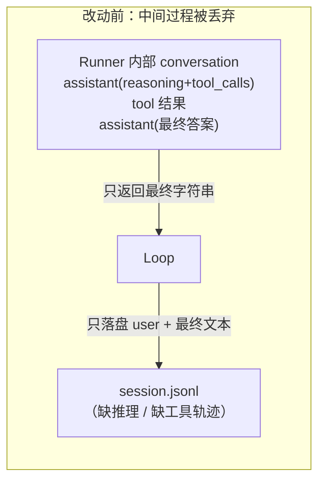
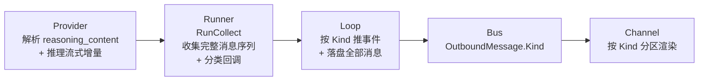
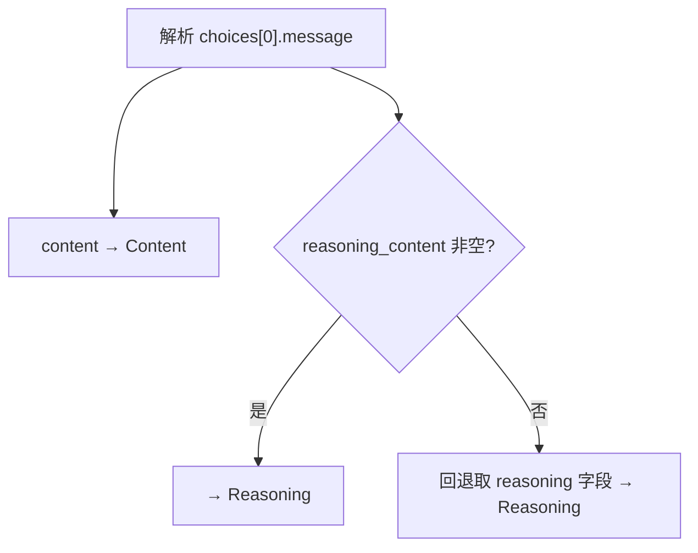
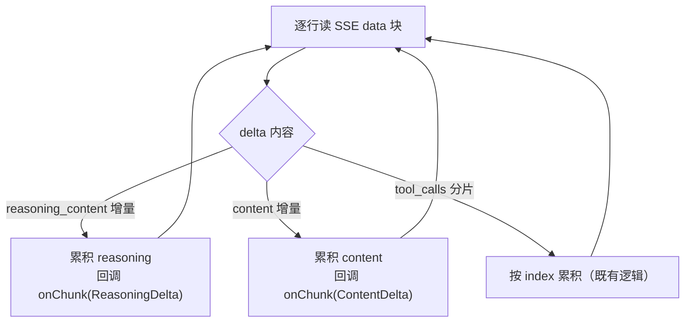
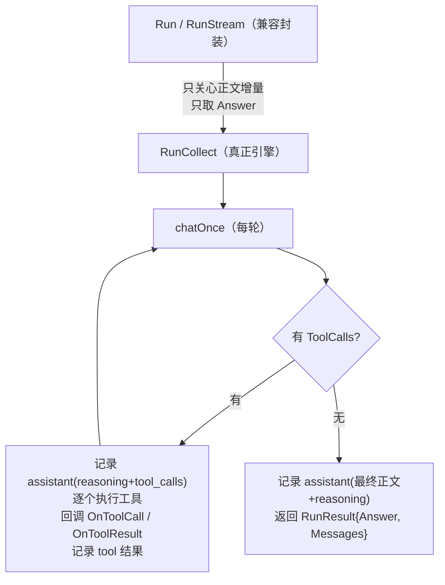
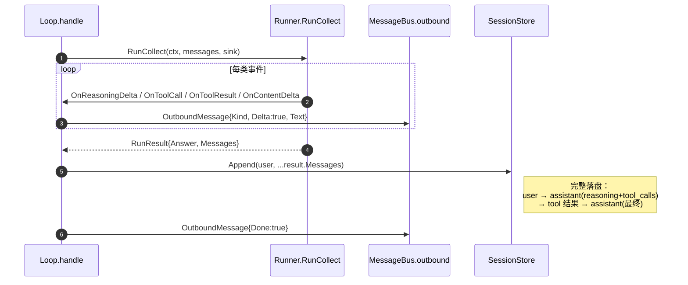

# 本次改动总结：推理类型 + 工具类型的事件流持久化

> 变更复盘：本文记录一次历史迭代。当前行为请以根目录 README 和
> [`docs/README.md`](README.md) 列出的实现文档为准。

本文档归档一次连续迭代中对 `szabot` 所做的一项核心改动：**把「推理过程（reasoning）」与「工具调用/工具结果」也纳入事件流，既实时推送给 channel，又完整落盘到 session**。

在此之前，session jsonl 只剩两类纯文本记录：

```jsonl
{"role":"user","content":"..."}
{"role":"assistant","content":"..."}
```

推理型模型的思考过程、以及一整条工具调用轨迹（assistant 的 `tool_calls` + tool 结果）在 `Runner` 内部被消化后就丢失了——既看不到，也不落盘。本次改动把它们补齐。

涉及的核心文件：

- [provider.go](../internal/providers/provider.go) — `Message` / `ChatResponse` / `StreamChunk` 补 reasoning 字段
- [openai_compatible.go](../internal/providers/openai_compatible.go) — 非流式解析 `reasoning_content`
- [stream.go](../internal/providers/stream.go) — 流式解析推理增量
- [runner.go](../internal/agent/runner.go) — 新增 `StreamSink` / `RunResult` / `RunCollect`，收集完整消息序列
- [events.go](../internal/bus/events.go) — `OutboundMessage` 增加 `Kind`（事件类型）
- [loop.go](../internal/agent/loop.go) — 分类推送出站 + 落盘完整轨迹
- [cli.go](../internal/channels/cli.go) — `writeLoop` 按 Kind 分区渲染
- [web.go](../internal/channels/web.go) — SSE 载荷带上 `kind`

---

## 第一部分：问题背景

### 1.1 现象

以一次真实 session 为例，磁盘上的 jsonl 里只有 user / assistant 两类纯文本行。即便这一轮里模型「先思考、再调用工具读取文件、再总结」，落盘的也只有最终那句总结。

### 1.2 根因

问题出在两处：

1. **数据模型里没有「推理」的位置**。`Message` / `ChatResponse` / `StreamChunk` 都没有 reasoning 字段，推理型模型（DeepSeek-R1、OpenAI o 系列）单独返回的 `reasoning_content` 被直接丢弃。
2. **中间过程用完即弃**。`Runner.RunStream` 内部虽然拼了含 `tool_calls`、tool 结果的完整 `conversation`，但**只返回最终字符串**；`Loop.handle` 随后也只写这一条：

```go
// 改动前：只落盘 user + 最终 assistant 文本
l.Store.Append(in.SessionID, userMsg,
    providers.Message{Role: providers.RoleAssistant, Content: reply})
```



---

## 第二部分：解决方案总览

沿用项目既有的「可选能力 + 分片事件」风格，分三层打通推理与工具的事件流：



设计原则（与项目其余部分保持一致）：

- **推理是可选的**：普通模型不返回 `reasoning_content`，对应字段恒为空，链路自动退化，零副作用。
- **向后兼容优先**：`Run` / `RunStream` 的旧签名与旧测试一行不改；新增 `RunCollect` 承载完整能力。`OutboundMessage.Kind` 零值即旧「正文」语义，旧 channel 无需改动。
- **落盘即事件流**：推送给用户看的分类事件，与写进 session 的消息序列同源，不再各写一套。

---

## 第三部分：Provider 层——解析推理

### 3.1 数据模型扩展（provider.go）

```go
type Message struct {
    Role       Role
    Content    string
    Reasoning  string     // 新增：推理过程，独立于 content，仅展示/回放用
    ToolCalls  []ToolCall
    ToolCallID string
}

type ChatResponse struct {
    Content      string
    Reasoning    string   // 新增
    ToolCalls    []ToolCall
    FinishReason string
}

type StreamChunk struct {
    ContentDelta   string
    ReasoningDelta string  // 新增：推理增量
    ToolCalls      []ToolCall
    Done           bool
    FinishReason   string
}
```

**为什么用独立字段而非塞进 content**：推理内容只做展示与回放，不会作为 content 回传给模型（否则会污染下一轮上下文）。独立字段让「思考」与「答案」各行其道，落盘的 jsonl 也以 `reasoning` 单独成键、可读且互不干扰。

### 3.2 非流式解析（openai_compatible.go）

响应侧 wire 结构同时兼容两种字段名（DeepSeek 用 `reasoning_content`，部分实现用 `reasoning`），取非空者填入 `ChatResponse.Reasoning`。请求侧始终 `omitempty` 且从不设置，保证发出去的请求体不带推理内容。



### 3.3 流式解析（stream.go）

SSE 的 `delta` 里也可能带 `reasoning_content` 增量。推理型模型的典型顺序是**先「想」再「说」**：先来若干 `reasoning_content` 片，再来 `content` 片。



最终返回的 `ChatResponse` 同时带上累积好的 `Content` 与 `Reasoning`。

---

## 第四部分：Runner 层——收集完整轨迹（核心）

### 4.1 新增 StreamSink 与 RunResult（runner.go）

此前 `Runner` 只把最终正文按增量吐给一个 `onDelta func(string)`，推理与工具事件无从暴露、中间消息用完即弃。本次引入两个新概念：

```go
// 一轮对话内部各类事件的实时回调集合（回调均可为 nil）
type StreamSink struct {
    OnContentDelta   func(string)                          // 正文增量
    OnReasoningDelta func(string)                          // 推理增量
    OnToolCall       func(providers.ToolCall)              // 工具调用（执行前）
    OnToolResult     func(call providers.ToolCall, result string) // 工具结果（执行后）
}

// 一轮 Run 的产物
type RunResult struct {
    Answer   string              // 面向用户的最终正文（与旧 Run 返回值一致）
    Messages []providers.Message // 本轮新增的全部消息，按发生顺序
}
```

`RunResult.Messages` 是关键：它按发生顺序收录**每个 tool-call 轮的 assistant 消息（含 `Reasoning` + `ToolCalls`）、对应的 tool 结果消息、以及最终那条 assistant 正文消息**。`Loop` 只要把它整体追加进 session，推理与工具轨迹就全部持久化了。

### 4.2 新引擎 RunCollect + 旧方法降级为封装



- `RunCollect(ctx, messages, sink)` 承载完整能力，是唯一真正的对话循环。
- `RunStream(ctx, messages, onDelta)` 与 `Run` 保持**旧签名不变**，内部转调 `RunCollect`，只订阅 `OnContentDelta`、只返回 `Answer`。既有测试无需改动。

### 4.3 一个踩过的坑：非流式回退的推理回调

`chatOnce` 在 provider 不支持流式时会回退到一次性 `Chat`，再把完整正文/推理当作「一个大增量」回调。**最初的写法把推理回调也限制在「无 tool_calls 时」**，导致带工具调用那一轮的推理没被发出去。

修正：**推理无条件回调**（推理与工具调用天然共存），只有正文回调仍限制在无 `tool_calls` 时（中间轮正文通常为空/无意义，避免混进最终答案）。

```go
// 修正后（chatOnce 非流式回退分支）
if response.Reasoning != "" && sink.OnReasoningDelta != nil {
    sink.OnReasoningDelta(response.Reasoning)              // 无条件
}
if len(response.ToolCalls) == 0 && response.Content != "" && sink.OnContentDelta != nil {
    sink.OnContentDelta(response.Content)                 // 仅无工具调用时
}
```

---

## 第五部分：Bus 层——事件类型标记

[events.go](../internal/bus/events.go) 给出站消息引入 `Kind`：

```go
type OutboundKind string

const (
    KindAnswer     OutboundKind = ""            // 正文（默认零值，兼容旧行为）
    KindReasoning  OutboundKind = "reasoning"   // 推理过程增量
    KindToolCall   OutboundKind = "tool_call"   // 工具调用
    KindToolResult OutboundKind = "tool_result" // 工具结果
)

type OutboundMessage struct {
    // ...既有字段...
    Kind  OutboundKind // 新增：内容类型，默认 KindAnswer
    Delta bool
    Done  bool
}
```

引入前，出站流只能表达「正文增量 / 收尾」，推理与工具无从区分。有了 `Kind`，channel 就能把思考、工具调用、正文分区渲染，而无需猜测 `Text` 的语义。零值 `KindAnswer` 保证旧 channel 不改也能继续把 `Text` 当正文处理。

---

## 第六部分：Loop 层——分类推送 + 落盘全量

[loop.go](../internal/agent/loop.go) 的 `handle`：

1. 构造统一发送器 `emit(kind, text)`：各类事件都以 `Delta=true` + 对应 `Kind` 的分片流过 bus。
2. 用 `emit` 组装 `StreamSink`（正文/推理直接透传，工具调用/结果格式化成简短可读文本），调用 `RunCollect`。
3. **落盘**：把 `userMsg + result.Messages` 整体 `Append` 进 Store。



改动前后对比：

| 环节 | 改动前 | 改动后 |
|---|---|---|
| 落盘内容 | `user` + 最终 `assistant` 文本 | `user` + `result.Messages`（推理 + 工具轨迹 + 最终答案） |
| 出站事件类型 | 仅正文 Delta / Done | 正文 / 推理 / 工具调用 / 工具结果（按 `Kind`） |
| 推理过程 | 丢弃 | 实时推送 + 落盘 |
| 工具调用/结果 | 仅内部使用、丢弃 | 实时推送 + 落盘 |

---

## 第七部分：Channel 层——分区渲染

- **CLI**（[cli.go](../internal/channels/cli.go)）：`writeLoop` 按 `Kind` 分区——推理以暗色 `[思考]` 段显示、工具调用/结果各占一行带 `⚙` 标记、正文沿用 `szabot>` 前缀。用局部标志跟踪推理段的开合（单 goroutine，无需锁）。
- **Web**（[web.go](../internal/channels/web.go)）：SSE 载荷新增 `kind` 字段（空时归一为 `"answer"`），前端可据此把思考/工具/正文分区展示。

---

## 第八部分：落盘后的 jsonl 长这样

一轮「先思考 → 调用工具 → 总结」的对话，改动后完整落盘为：

```jsonl
{"role":"user","content":"帮我读下 README 并总结"}
{"role":"assistant","reasoning":"需要先调用 read_file","toolCalls":[{"id":"call_1","name":"read_file","arguments":{"path":"README.md"}}]}
{"role":"tool","toolCallId":"call_1","content":"（文件内容…）"}
{"role":"assistant","content":"这个项目是…","reasoning":"拿到内容后总结"}
```

> 说明：已存在的旧 jsonl 因当初未记录这些字段无法追溯补全，但读取时向后兼容（缺失字段即空）。

---

## 第九部分：测试

| 测试文件 | 新增覆盖点 |
|---|---|
| [openai_compatible_test.go](../internal/providers/openai_compatible_test.go) | `TestChatParsesReasoningContent`：非流式 `reasoning_content` 解析进 `Reasoning` 且不污染 `Content` |
| [stream_test.go](../internal/providers/stream_test.go) | `TestChatStreamReasoning`：流式推理增量单独回调为 `ReasoningDelta`、与正文互不混淆 |
| [runner_test.go](../internal/agent/runner_test.go) | `TestRunCollectCapturesReasoningAndToolMessages`：`RunResult.Messages` 含 assistant(推理+tool_calls) → tool 结果 → 最终 assistant，且各类回调触发正确 |
| [session_test.go](../internal/agent/session_test.go) | `TestLoopPersistsReasoningAndToolCalls`：一轮工具调用后，重新读盘验证 user → assistant(推理+tool_calls) → tool 结果 → 最终 assistant 完整落盘 |

`go vet ./...` + `go test ./...` 全部通过。

---

## 第十部分：一句话版

```text
本次改动 = 让「推理」和「工具调用」不再是内部黑箱，而是既能实时看到、又能落盘回放的事件。

Provider：新增 reasoning 字段，解析 reasoning_content（流式 / 非流式）。
Runner：  新增 RunCollect，把本轮所有中间消息收进 RunResult.Messages，
          并通过 StreamSink 把推理 / 工具调用 / 工具结果实时回调出来；
          Run / RunStream 降级为兼容封装，旧签名不动。
Bus：     OutboundMessage 加 Kind，区分正文 / 推理 / 工具调用 / 工具结果。
Loop：    按 Kind 推事件，并把 user + result.Messages 整体落盘。
Channel： CLI / Web 按 Kind 分区渲染。
```

关键设计点：

- **推理独立成字段**：不回传模型、不污染 content，只做展示与回放。
- **向后兼容优先**：旧方法与旧测试零改动；`Kind` 零值即旧正文语义。
- **落盘即事件流同源**：推送给用户的分类事件，与写进 session 的消息序列是同一份数据。
- **可选能力自动退化**：普通模型无推理内容时，整条链路无副作用。
