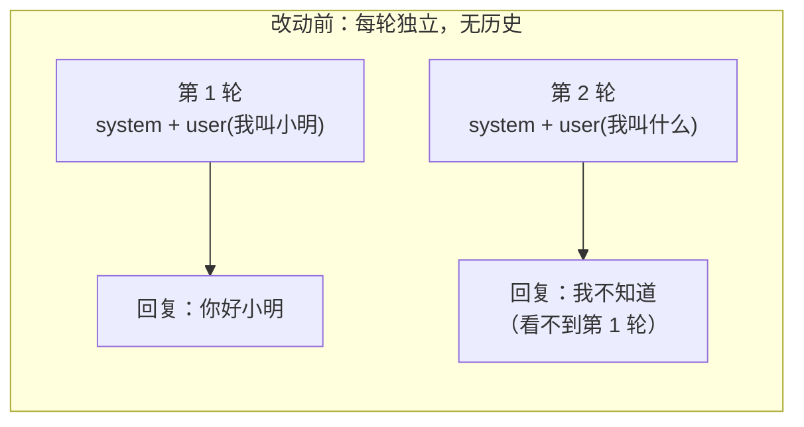
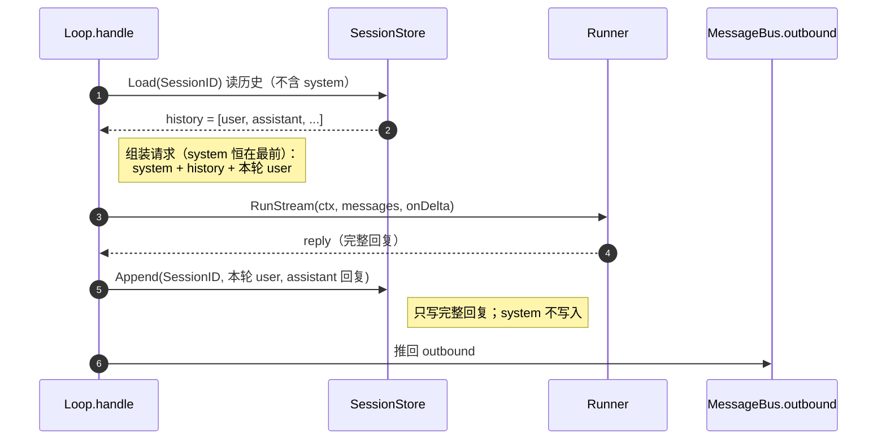
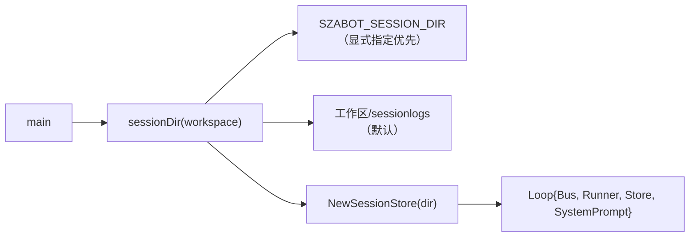
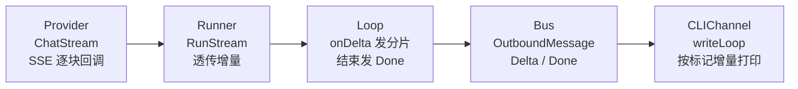
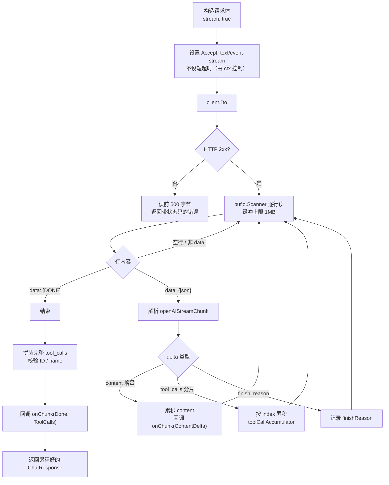
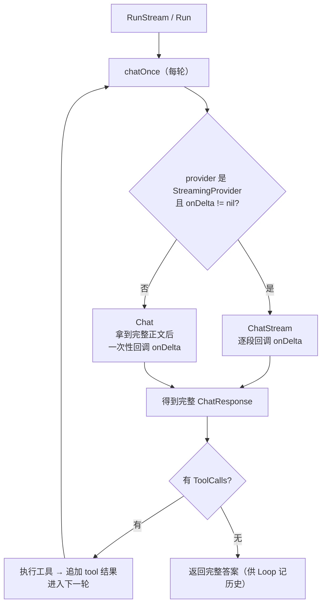
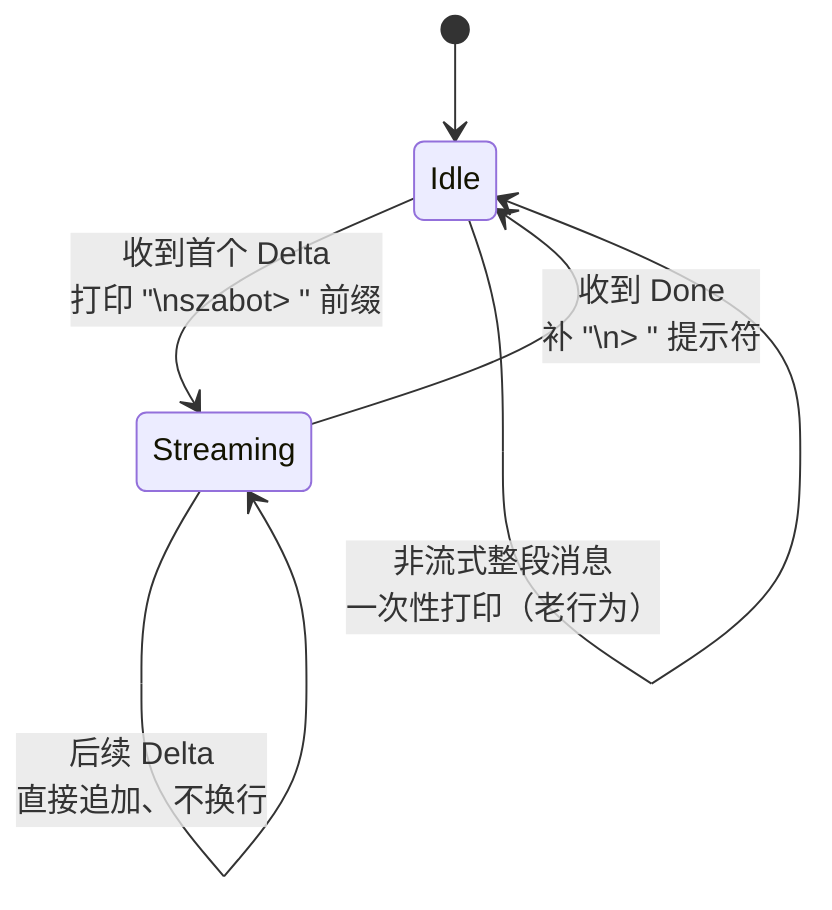
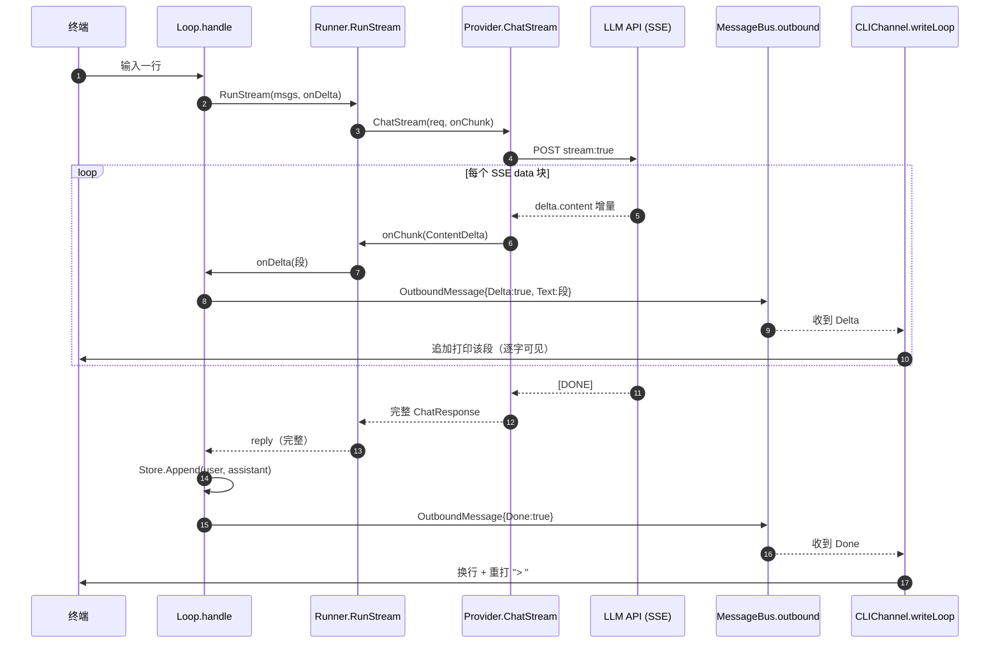

# 本次改动总结：Session 历史持久化 + SSE 流式回复

> 变更复盘：本文记录一次历史迭代。当前行为请以根目录 README 和
> [`docs/README.md`](README.md) 列出的实现文档为准。

本文档归档一次连续迭代中对 `szabot` 所做的两项核心改动，以及为把它们贯通所触及的全部文件、数据结构与测试。

两项改动：

1. **Session 历史持久化（对应路线图 M8）**：修复"同一 session 内，每次请求都不带此前对话历史"的问题——现在按 `SessionID` 把历史以 jsonl 落盘，后续请求会带上上下文。
2. **SSE 流式回复**：把回复从"一次性整段返回"改为"逐段增量输出"，字符边生成边在终端蹦出。

涉及的核心文件：

- [provider.go](../internal/providers/provider.go) — 消息结构补 JSON tag、新增流式接口
- [stream.go](../internal/providers/stream.go) — OpenAI 兼容 provider 的 SSE 实现（新增）
- [session.go](../internal/agent/session.go) — jsonl SessionStore（新增）
- [loop.go](../internal/agent/loop.go) — 加载/回写历史 + 改用流式
- [runner.go](../internal/agent/runner.go) — 新增 `RunStream`，探测并透传流式
- [events.go](../internal/bus/events.go) — `OutboundMessage` 增加 `Delta` / `Done` 标记
- [cli.go](../internal/channels/cli.go) — `writeLoop` 按标记增量输出
- [main.go](../cmd/szabot/main.go) — 装配 SessionStore

---

## 第一部分：Session 历史持久化

### 1.1 问题背景

改动前，`Loop.handle` 每收到一条入站消息都**从零构造** `messages`，只包含 `system prompt + 当前这一句 user`，从不加载此前的对话。因此哪怕是同一个 `SessionID`（CLI 固定为 `cli:local`），第二轮请求也看不到第一轮的问答——表现为"失忆"。

`Runner.Run` 内部虽有一个 `conversation`，但那只是**单次请求内**为 tool-call 循环临时拼接的，函数返回即丢弃，不跨请求保留。



### 1.2 解决方案：jsonl SessionStore

按你选定的方案落地：**落盘 jsonl** + **system prompt 恒在最前（不写入历史）**。

新增 [session.go](../internal/agent/session.go) 中的 `SessionStore`：

- **存储形态**：每个 session 一个文件 `<dir>/<sessionID>.jsonl`，每行是一条 `providers.Message` 的 JSON。
- **为什么一 session 一文件 + 追加写**：对话只在末尾增长，`Append` 就是往文件尾追加一行，无需读改写整个文件。
- **只存对话历史**（user / assistant / tool），**不存 system prompt**——system prompt 启动时构建、全程不变，由 `Loop` 每次请求时恒定拼在最前，既不反复写盘，又保证前缀稳定、对 KV Cache 友好。
- **内存缓存**：`Load` 首次读盘后缓存，之后走内存，避免每轮读盘。
- **持久化安全**：`Append` 走 `bufio.Writer` + `f.Sync()`（fsync），进程/机器异常时历史不丢。
- **防路径穿越**：`SessionID` 经 `filepath.Base(filepath.Clean("/"+id))` 清洗，杜绝 `../x` 之类逃逸。

对外接口：

```go
func NewSessionStore(dir string) (*SessionStore, error)
func (s *SessionStore) Load(sessionID string) ([]providers.Message, error)
func (s *SessionStore) Append(sessionID string, messages ...providers.Message) error
```

### 1.3 Loop 的新流程



改动前后对比（`Loop.handle` 内部）：

| 环节 | 改动前 | 改动后 |
|---|---|---|
| 历史来源 | 无，每轮从零 | `Store.Load(SessionID)` |
| 请求组成 | `system + user` | `system + history + user` |
| 回写 | 无 | `Store.Append(user, assistant)` |
| system prompt | 每轮拼在最前 | 每轮拼在最前（不进 Store） |

### 1.4 装配（main.go）



存储目录默认落在**工作区下的 `sessionlogs/`**，可用环境变量 `SZABOT_SESSION_DIR` 覆盖。

---

## 第二部分：SSE 流式回复

### 2.1 问题背景

改动前整条链路**全程非流式**：`Provider.Chat` 请求体 `stream:false`，还 `io.ReadAll` 整个响应体 → `Runner.Run` 返回一整个 string → `Loop` 发一条完整 `OutboundMessage` → CLI 一次性打印。用户必须等模型全部生成完才能看到任何字。

目标：让 token 增量从 provider 一路"漏"到 channel，边生成边显示。

### 2.2 分层设计总览

按"复用 outbound + 分片消息"的方向，四层各打通一条增量通道：



设计原则：

- **流式是可选能力**：用独立接口 `StreamingProvider` + 类型断言探测，不改 `Chat`，不实现它的 provider（如 `EchoProvider`）自动回退，零改动。
- **一段回复 = 多条分片 + 一条收尾**：复用现有 `OutboundMessage` 流过 bus，channel 按标记拼接。
- **只有最终轮正文流给用户**：tool-call 中间轮正文通常为空，不污染最终答案。

### 2.3 Provider 层：StreamingProvider 接口

[provider.go](../internal/providers/provider.go) 新增：

```go
type StreamChunk struct {
    ContentDelta string     // 文本增量
    ToolCalls    []ToolCall // 拼装完成的工具调用（收尾时给出）
    Done         bool       // 结束标记
    FinishReason string
}

type StreamingProvider interface {
    Provider
    ChatStream(ctx context.Context, req ChatRequest,
        onChunk func(StreamChunk) error) (ChatResponse, error)
}
```

同时给 `Message` / `ToolCall` 补上显式 JSON tag（`role`/`content`/`toolCalls`/`toolCallId` 等），让 session jsonl 落盘的 schema 稳定、可读。

### 2.4 Provider 层：SSE 解析（stream.go）

新增 [stream.go](../internal/providers/stream.go)，`OpenAICompatibleProvider.ChatStream`：



**关键难点：`tool_calls` 是分片的**。OpenAI 流式里，工具调用按 `index` 分多片下发：`id` / `name` 一般只在该 index 的第一片出现，`arguments` 逐片以字符串拼接。`toolCallAccumulator` 按 index 累积还原：

```text
片1: {index:0, id:"call_1", function:{name:"grep", arguments:"{\"pat"}}
片2: {index:0,               function:{             arguments:"tern\":\"foo\"}"}}
     ↓ 拼装
{id:"call_1", name:"grep", arguments:{"pattern":"foo"}}
```

文件末尾用编译期断言 `var _ StreamingProvider = (*OpenAICompatibleProvider)(nil)` 保证接口一致。

### 2.5 Runner 层：RunStream

[runner.go](../internal/agent/runner.go)：

- `Run` 保持原签名向后兼容，内部转调 `RunStream(ctx, messages, nil)`。
- 新增 `RunStream(ctx, messages, onDelta func(string))`。
- 抽出 `chatOnce`：探测 provider 是否 `StreamingProvider`——
  - 支持且 `onDelta != nil`：走 `ChatStream`，`ContentDelta` 非空时透传给 `onDelta`；
  - 否则：回退 `Chat`，并把完整正文当作"一个大增量"回调一次，让上层展示逻辑无需分支。



无论流式与否，函数最终都返回完整答案字符串，语义与原 `Run` 一致，因此 Loop 记历史、判断停止的逻辑一行不用改。

### 2.6 Bus 层：OutboundMessage 加标记

[events.go](../internal/bus/events.go) 给 `OutboundMessage` 增加：

```go
Delta bool // true = 一段增量（流式中的一小块正文）
Done  bool // true = 本轮回复到此结束（收尾标记）
```

一段完整回复被拆成：**若干条 `Delta` 分片 + 一条 `Done` 收尾**。非流式/回退也可只发一条 `Delta=false,Done=false` 的整段消息，channel 按老行为处理，向后兼容。

### 2.7 Channel 层：writeLoop 增量输出

[cli.go](../internal/channels/cli.go) 的 `writeLoop` 按标记打印：



用一个局部 `streaming` 标志跟踪"本轮是否已打过前缀"（`writeLoop` 是单 goroutine 顺序处理，无需加锁）。

### 2.8 端到端时序（流式版）



---

## 第三部分：测试

| 测试文件 | 覆盖点 |
|---|---|
| [session_test.go](../internal/agent/session_test.go) | jsonl 落盘 round-trip、跨 store 实例重读、session 隔离；**核心回归**：同一 session 第二次请求带上 `system + user(first) + assistant(first-reply) + user(second)`；不同 SessionID 互不串扰 |
| [stream_test.go](../internal/providers/stream_test.go) | SSE 正文增量顺序与累积、tool_calls 跨片拼装（还原成 `{"pattern":"foo"}`）、HTTP 401 错误 |
| [runner_test.go](../internal/agent/runner_test.go) | `RunStream` 流式增量逐段透传、provider 不支持流式时回退为整段回调 |
| [cli_test.go](../internal/channels/cli_test.go) | 多条 Delta 拼成同一前缀下的整段、前缀只出现一次、Done 后补提示符、忽略其他 channel 的消息 |

全部测试 + `go test ./... -race` 通过。

---

## 第四部分：如何验证 / 使用

```bash
# 接 DeepSeek，回复会逐字蹦出，且同一会话能记住上下文
export SZABOT_PROVIDER=deepseek DEEPSEEK_API_KEY=sk-xxx
go run ./cmd/szabot

> 我叫小明
szabot> 你好，小明！（逐字出现）
> 我叫什么名字？
szabot> 你叫小明。（记住了上一轮）
```

历史文件落在 `sessionlogs/cli:local.jsonl`（工作区下，可用 `SZABOT_SESSION_DIR` 改目录）。

说明：

- **EchoProvider 无真流式**：它不实现 `StreamingProvider`，`RunStream` 回退为整段一次性输出，功能正常但不逐字。
- **工具调用轮不流式给用户**：只有最后一轮（无 tool_calls）的正文会流出。

---

## 第五部分：一句话版

```text
本次改动 = 给对话装上「记忆」+ 给回复装上「流式」

记忆：SessionStore 按 SessionID 落盘 jsonl，
      Loop 每轮 Load 历史拼在 system 之后、本轮 user 之前，
      结束后 Append(user, assistant)，system prompt 永不入库。

流式：Provider 新增可选的 ChatStream（SSE 逐块 + tool_calls 按 index 拼装），
      Runner.RunStream 探测并透传增量（不支持则回退整段），
      OutboundMessage 用 Delta/Done 分片流过 Bus，
      CLIChannel.writeLoop 边收边打印。
```

关键设计点：

- **可选能力接口 + 类型断言**：新特性不侵入既有 `Provider.Chat`，老实现零改动、自动回退。
- **system prompt 恒在最前且不入库**：兼顾"带历史"与"KV Cache 友好"。
- **一段回复 = 分片 + 收尾**：复用 `OutboundMessage` 与 Bus，channel 不需要新通道就能流式。
- **完整回复始终作为返回值**：流式只影响"怎么显示"，不影响"记什么历史、何时停止"。
