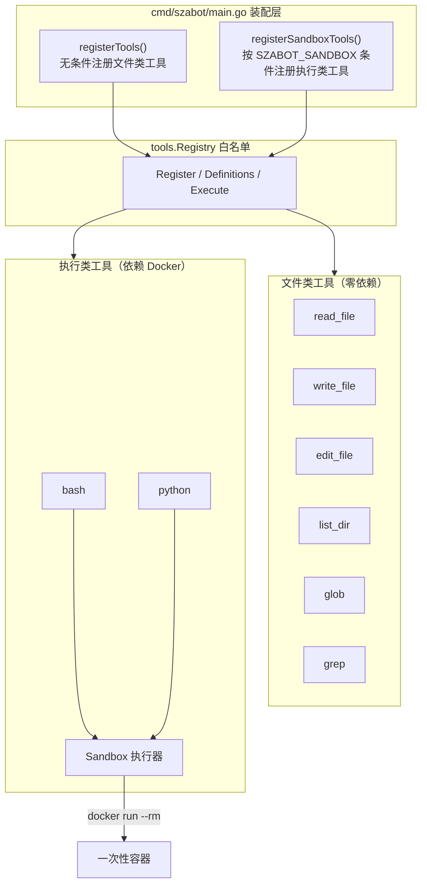
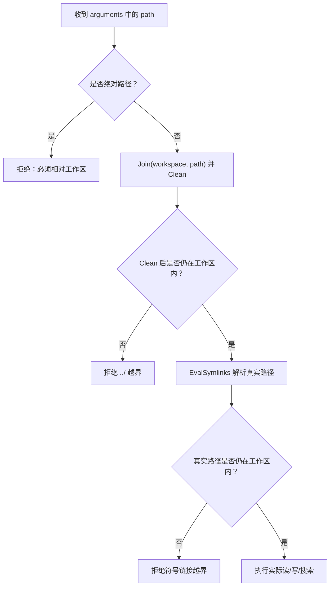
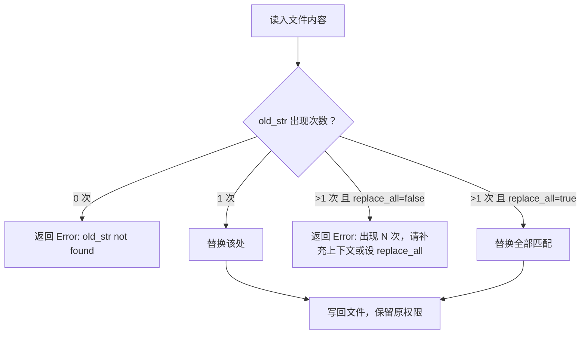
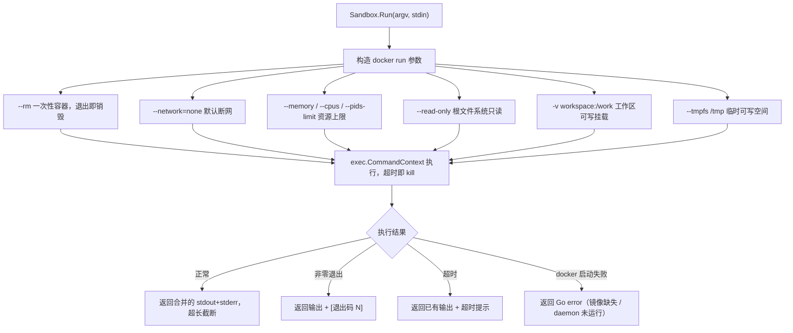
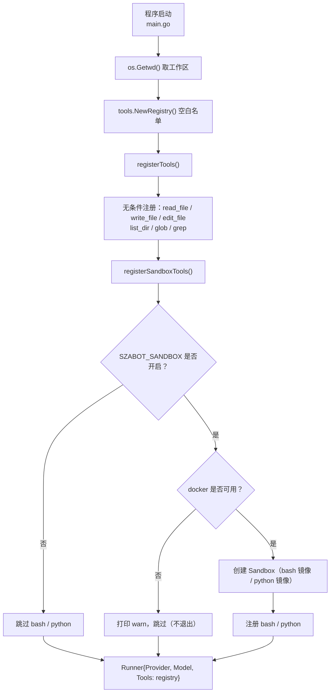
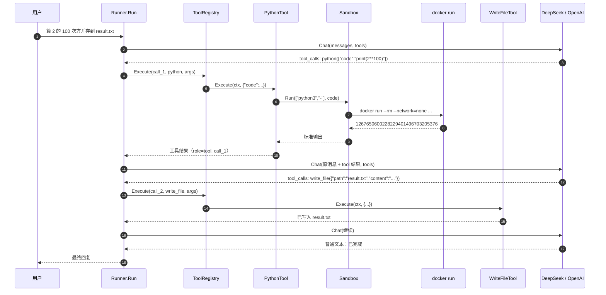

## 工具箱扩展：文件工具 + Docker 沙盒执行工具

> 变更复盘：本文记录工具箱扩展过程。当前工具清单和启用条件请以
> [`README.md`](../README.md) 与 [`tools-and-sandbox.md`](tools-and-sandbox.md) 为准。

本文档归档 `szabot` 一次工具集成的完整设计：在原有单一 `read_file` 的基础上，补齐一套「基础 Coding Agent 的核心工具」——读、写、编辑、列目录、按文件名查找、按内容查找，以及在 Docker 沙盒中安全执行 Bash 与 Python 的能力。

这次扩展**没有改动任何核心流程**：`Tool` 接口、`Registry`、`Runner` 的 tool-call 循环都保持不变，所有新能力只是「实现 `tools.Tool` 接口 + 在装配层注册」。这正是设计宪法第一条「Core stays small；extend at the edges」的体现。

涉及的核心文件：

- [main.go](../cmd/szabot/main.go)
- [tool.go](../internal/tools/tool.go)
- [workspace.go](../internal/tools/workspace.go)
- [read_file.go](../internal/tools/read_file.go)
- [write_file.go](../internal/tools/write_file.go)
- [edit_file.go](../internal/tools/edit_file.go)
- [list_dir.go](../internal/tools/list_dir.go)
- [glob.go](../internal/tools/glob.go)
- [grep.go](../internal/tools/grep.go)
- [sandbox.go](../internal/tools/sandbox.go)
- [bash.go](../internal/tools/bash.go)
- [python.go](../internal/tools/python.go)

### 1. 一个基础 Coding Agent 需要哪些工具

一个极简但完整的工具箱通常包含七个核心工具。下表是它们与 `szabot` 实现的对应关系：

| # | 核心工具 | 作用 | szabot 实现 | 依赖 |
|---|---|---|---|---|
| 1 | Code Interpreter | 隔离沙盒中安全执行 Python | `python` | Docker |
| 2 | Bash Shell | 执行命令、跑测试、处理文件 | `bash` | Docker |
| 3 | 读文件 | 读代码、配置、日志 | `read_file` | 无 |
| 4 | 写文件 | 新建或完全重写文件 | `write_file` | 无 |
| 5 | 编辑文件 | 对现有文件局部修改 | `edit_file` | 无 |
| 6 | Glob | 按文件名模式定位文件 | `glob` | 无 |
| 7 | Grep | 按内容搜索文本模式 | `grep` | 无 |

额外补充了一个准核心工具 `list_dir`（列目录），用于在路径未知时先探索目录结构，是 Glob 的补充。

这些工具分成两类，安全模型完全不同：

- **文件类（3–7 + list_dir）**：只在工作区目录内读写，靠**路径隔离**即可保证安全。
- **执行类（1、2）**：会真正执行任意代码、可能改变宿主机，必须依赖**操作系统级沙盒**（Docker）。

### 2. 分层视角：工具挂在哪一层



要点：

- 文件类工具**启动即注册**，任一创建失败都视为致命错误、程序退出（工具集是 agent 的能力清单，缺失会导致行为不可预测）。
- 执行类工具是**能力增强而非核心必需**：`SZABOT_SANDBOX` 未开启或 Docker 不可用时，只打印提示并跳过，其余工具照常可用。

### 3. 共享的沙盒边界：`workspace.go`

所有文件类工具都不直接把模型给出的路径交给 `os` 包，而是先经过一层统一的工作区校验。这段逻辑被抽到 [workspace.go](../internal/tools/workspace.go)，供所有文件工具复用，把「安全边界」收敛到一处：

```text
resolveWorkspace(dir)   校验工作区存在、是目录，返回解析软链后的绝对路径
joinInWorkspace(ws, p)  拒绝绝对路径与 ../ 越界，返回工作区内的目标路径
isWithinWorkspace(w, p) 判断 p 是否仍位于 w 之内
```

任何文件工具收到路径后的处理次序：



因此模型即使请求 `write_file({"path":"../../.ssh/authorized_keys", ...})`，也只会收到一个工具错误，而不会写到工作区之外。

### 4. 文件类工具逐一说明

每个工具都实现同一个 `tools.Tool` 接口（`Name / Description / Parameters / Execute`），并各自负责自己的参数与安全校验。

| 工具 | 关键参数 | 行为要点 | 安全约束 |
|---|---|---|---|
| `read_file` | `path` | 最多读 32 KiB，仅 UTF-8 文本，超长附截断提示 | 工作区内、拒目录 |
| `write_file` | `path`, `content` | 完全覆盖写入，自动创建父目录 | 工作区内、拒写目录、校验 UTF-8 |
| `edit_file` | `path`, `old_str`, `new_str`, `replace_all` | `old_str` 精确替换 `new_str`；默认要求唯一匹配 | 工作区内、限制文件大小 |
| `list_dir` | `path`, `recursive` | 列目录，可递归，目录以 `/` 结尾 | 工作区内、忽略 `.git`/`node_modules` 等噪声 |
| `glob` | `pattern` | 按文件名模式匹配，支持 `**` 递归通配 | 工作区内、结果上限 200 |
| `grep` | `pattern`, `include` | 按正则逐行搜索，返回 `文件:行号:内容` | 工作区内、跳过二进制与超大文件 |

`edit_file` 的匹配语义（Coding Agent 迭代修改的核心）：



### 5. 执行类工具：Docker 沙盒执行器

`bash` 和 `python` 不在宿主机直接执行，而是共用一个 [sandbox.go](../internal/tools/sandbox.go) 中的 `Sandbox`，每次执行都起一个一次性容器。

沙盒对每次执行施加的隔离：



两个关键设计点：

- **脚本经 stdin 传入，而非拼进命令行**：`bash` 走 `bash -s`、`python` 走 `python3 -`，彻底规避 shell 注入与转义问题。
- **执行出错返回退出码而非 Go error**：与 `Runner`「工具错误回喂给模型」的约定一致，模型能看到退出码或超时后自行调整，而不会中断整条 agent 循环。

这满足了 Code Interpreter「即使出错也不会影响宿主机」的定义：`--read-only` + `--network=none` + 资源上限 + `--rm` 共同构成真正的 OS 级隔离。代价是默认无法联网、无法写根文件系统（如 `pip install`），需要时可通过环境变量放开。

### 6. 装配层：工具如何被注册



相关环境变量：

| 变量 | 作用 | 默认 |
|---|---|---|
| `SZABOT_SANDBOX` | 设为非空启用 `bash` + `python` | 关闭 |
| `SZABOT_SANDBOX_NETWORK` | 设为非空允许容器联网 | 断网 |
| `SZABOT_PYTHON_IMAGE` | python 工具使用的镜像 | `python:3.12-slim` |
| `SZABOT_BASH_IMAGE` | bash 工具使用的镜像 | `debian:stable-slim` |

### 7. 一次工具调用如何贯穿全链路

以「在沙盒里用 Python 计算并把结果写入文件」为例，展示新工具如何嵌入既有的 Function Calling 循环：



注意整条链路中 `Runner` 完全不感知工具是「本地文件操作」还是「容器内执行」——它只负责多轮编排，具体能力由各 `Tool` 自己实现。

### 8. 安全与职责边界

| 层 | 职责 | 不负责 |
|---|---|---|
| `main` | 决定启用哪些工具、工作区在哪、沙盒是否开启 | 工具内部逻辑 |
| `Registry` | 工具白名单、导出定义、按名查找执行 | 参数与安全校验 |
| `workspace.go` | 文件类工具的统一路径边界 | 具体读写行为 |
| `Sandbox` | 执行类工具的容器隔离与资源限制 | 命令内容本身 |
| 各 `Tool` | 单个能力实现 + 自己的参数/安全校验 | 多轮编排、厂商协议 |
| `Runner` | 多轮 tool-call 循环 | 工具实现、沙盒细节 |

两条安全底线：

- 文件类工具**永远无法逃出工作区**（路径 + 软链双重校验）。
- 执行类工具**永远无法影响宿主机**（一次性容器 + 只读根 + 断网 + 资源上限）。

### 9. 当前范围与后续扩展

已支持：

- 七个核心工具全部就位，外加 `list_dir`；
- 文件类工具零依赖、纯 Go 标准库；
- 执行类工具基于 Docker 一次性容器，无 Docker 时自动降级。

仍有明确边界：

- 同一轮的多个工具调用仍是**串行执行**（尚未按 `read_only` 标志并行）；
- `edit_file` 目前是精确匹配 + 唯一性检查，尚无「去缩进 / 引号归一化」等模糊匹配回退；
- 沙盒每次执行都是**全新容器、无状态**，跨调用不保留文件系统改动（工作区除外）与已安装依赖。

后续增加新工具时，核心 `Runner` 流程依然不需要改变：实现 `tools.Tool` 并在 `main` 注册即可；执行类工具可继续复用同一个 `Sandbox`。

### 10. 一句话版

```text
文件类工具：靠 workspace 路径隔离，读写搜都锁在工作区内
执行类工具：靠 Docker 一次性容器，bash/python 出错也不伤宿主机
注册即授权：main 显式注册，文件类必装、执行类按 SZABOT_SANDBOX 开关
核心不变：新增工具只实现 Tool 接口并注册，Runner / Provider 全程无感知
```
